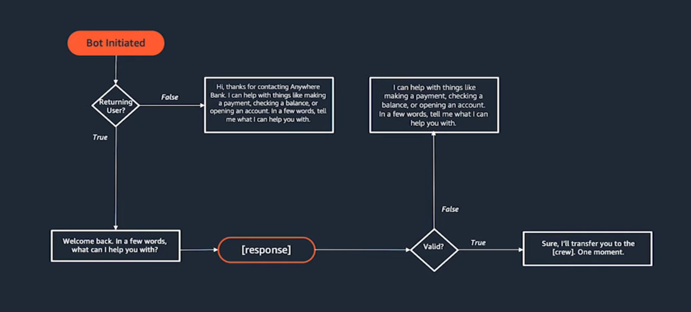

### Conversational Desigin
- Set Expectation around the constraints of the application
- Anticipate breaking points and accommodate for them.
- Use context and memory  to modify responses.
- Conform to the way that humans speak, and not the other way around.
- Conversational Interface: voice, text, chatbot, other platforms.
- Identify use cases:
     UseCase:   As a __member__ I want to __know the contact number___ so that _I can call with regard to my some questions_.
     

     Problem: member want to know contact address/number
     opportunity:
- Define the persona: brand guidlines. secure and trustworthy financial products, innovatives.
- script the happy path: Open-ended, Menu, form-fillings. how to present? confirming the intent?


- map flow documenting:
 

- interaction model


- prototyping
  

- test and iterate.


### Amazon Lex for NLU
Amazon Lex provides advanced natural language understanding (NLU) capabilities, which can interpret user input and manage conversation flows.
 - Integration with AWS Services: Lex integrates seamlessly with other AWS services, such as Lambda for executing business logic and AWS Step Functions for workflow orchestrations.
 - Ease of Setup: With Lex, setting up intents, utterances, and slots is relatively straightforward, providing a robust framework for managing various conversational scenarios.
 - Goal oriented dialog system that works by capturing utterances, intents and slots
 - Lex bots are designed to follow a structured conversation flow, where they elicit information from the user step-by-step to complete the desired task. This can sometimes feel less natural compared to a more open-ended conversation.  Remember, the goal of the Lex bot is to reliably capture the necessary information to fulfill the user's request,
  - multiple pieces of information in a single utterance.
  - Implementing more advanced natural language understanding (NLU) capabilities to better interpret the user's intent and context.


**Single Bot with Multiple Intents**
Centralized Management: Easier to manage and maintain a single bot with all related intents.
Consistent User Experience: Provides a seamless conversation experience as the user can interact with the bot on various topics without switching.
Efficiency: Reduces overhead and complexity compared to managing multiple bots.
Each intent within the bot is designed to handle specific tasks or responses, and the bot uses these intents to understand and process user inputs effectively.

### Development Deployment strategy


### Testing Strategy.
- [Test the Bot Using Text Input (AWS CLI)](https://docs.aws.amazon.com/lex/latest/dg/gs-create-test-text.html)
- Using webConsole.

### Create versions and aliases for deployment


### Rollback Strategy
- in console you can export and import back.
- through terraform as automation.
-


### Analytics and Monitoring/Observability
- https://us-east-1.console.aws.amazon.com/lexv2/home?region=us-east-1#bot/VKKIFWLLLZ/analytics/activityOverview


### multi context/intent conversation
- Simple... need to work.


#### Intent example
```json
{
  "name": "BookFlight",
  "sampleUtterances": [
    "I want to book a flight on {Date} in {Class} class.",
    "Book a flight for {Date} in {Class}.",
    "I need a flight on {Date}.",
    "I want to fly in {Class} class."
  ],
  "slots": [
    {
      "name": "Date",
      "slotType": "AMAZON.DATE",
      "slotConstraint": "Required",
      "valueElicitationPrompt": {
        "messages": [
          {
            "contentType": "PlainText",
            "content": "On what date would you like to book the flight?"
          }
        ],
        "maxAttempts": 2
      }
    },
    {
      "name": "Class",
      "slotType": "FlightClass",
      "slotConstraint": "Required",
      "valueElicitationPrompt": {
        "messages": [
          {
            "contentType": "PlainText",
            "content": "Which class would you like to book, Economy or Business?"
          }
        ],
        "maxAttempts": 2
      }
    }
  ],
  "fulfillmentActivity": {
    "type": "ReturnIntent"
  }
}

```


### Understanding Aliases in Amazon Lex
**Aliases** are pointers to specific versions of your Lex bot. They help manage and deploy your bot across different environments and stages.

#### Use Cases for Aliases

1. **Environment Segregation**:
   - **Dev**: `dev` alias points to the latest version in development.
   - **Test**: `test` alias points to the version currently being tested.
   - **Prod**: `prod` alias points to the stable production version.

2. **Smooth Transitions**:
   - Update the `prod` alias to point to a new version after successful testing, ensuring a seamless transition without changing client configurations.

3. **Multiple Aliases for the Same Version**:
   - Allows different testing or rollout strategies. For example, a `staging` alias might point to the same version as `test` for final pre-production validation.

### Example Workflow

1. **Development**:
   - `dev` alias -> Version 1.1

2. **Testing**:
   - Update `test` alias -> Version 1.2 for QA testing.
   - Update `staging` alias -> Version 1.2 for pre-production validation.

3. **Production**:
   - After testing, update `prod` alias -> Version 1.2 for production deployment.

### Real-World Example

Imagine a financial chatbot:

1. **Development**:
   - New feature to check investment portfolios: `dev` alias points to Version 1.3.

2. **Testing**:
   - QA team tests new feature: `test` alias points to Version 1.3.
   - Parallel testing for final validation: `staging` alias also points to Version 1.3.

3. **Production**:
   - Once validated, update `prod` alias to Version 1.3.

U

## Resources:
- [How to approach conversation design: The basics (Part 1)](https://aws.amazon.com/blogs/machine-learning/part-1-approach-conversation-design-the-basics/)
- [How to approach conversation design: Getting started with Amazon Lex (Part 2)](https://aws.amazon.com/blogs/machine-learning/part-2-how-to-approach-conversation-design-getting-started-with-amazon-lex/)
- [Drive efficiencies with CI/CD best practices on Amazon Lex](https://aws.amazon.com/blogs/machine-learning/)drive-efficiencies-with-ci-cd-best-practices-on-amazon-lex/
- https://www.youtube.com/watch?v=0zdU0W22F0s
- [Amazon Lex Model Building Service](https://docs.aws.amazon.com/lex/latest/dg/API_Operations_Amazon_Lex_Model_Building_Service.html)
- [Cost and Pricing](https://aws.amazon.com/lex/pricing/)
- [How it works](https://docs.aws.amazon.com/lexv2/latest/dg/how-it-works.html)
- [Amazon Lex V2 API Reference](https://docs.aws.amazon.com/lexv2/latest/APIReference/welcome.html)

- [Add an Amazon Lex bot to Amazon Connect](https://docs.aws.amazon.com/connect/latest/adminguide/amazon-lex.html)
