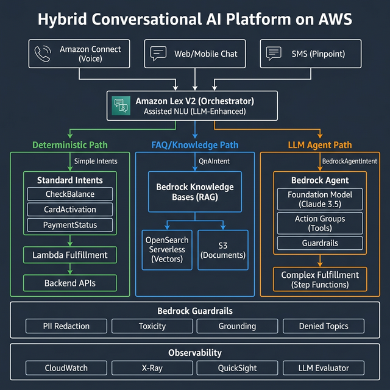
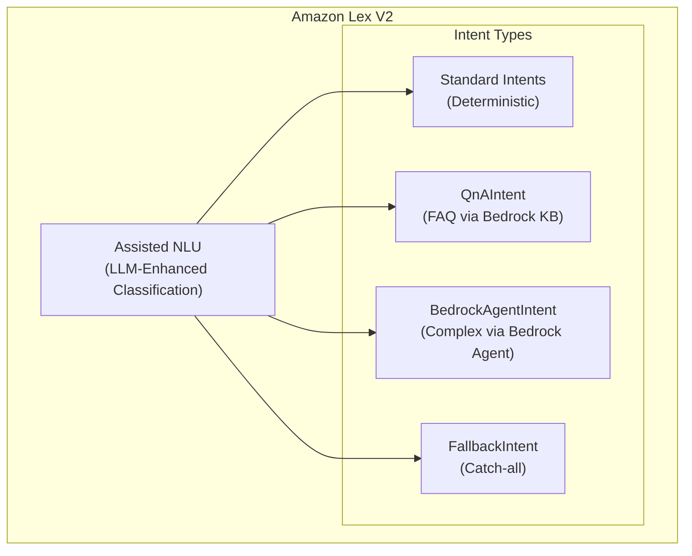
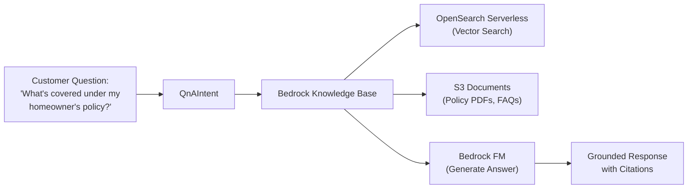
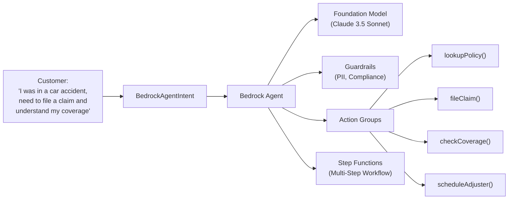
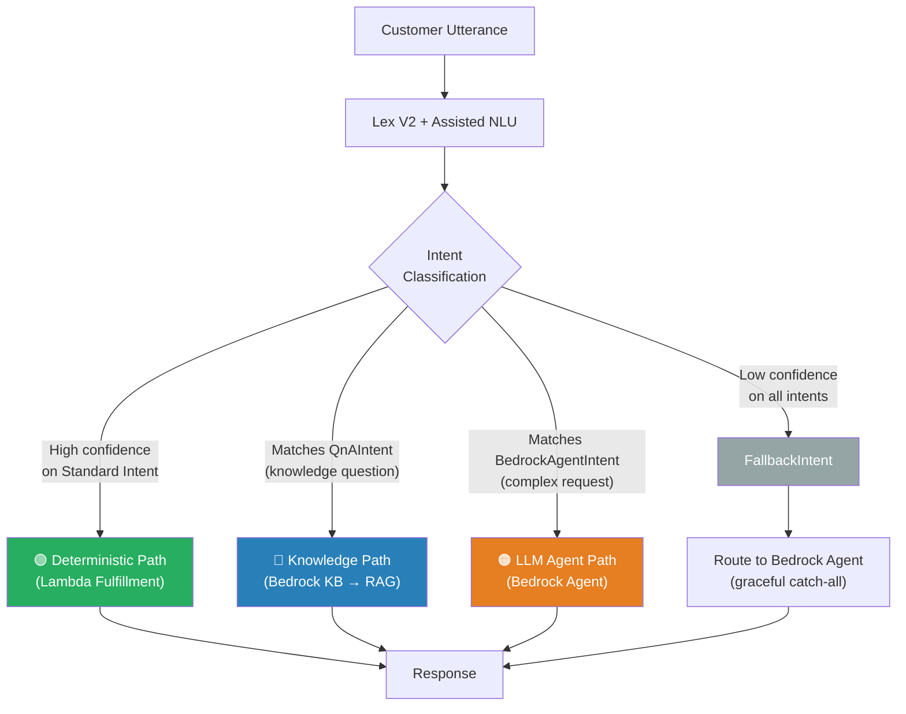
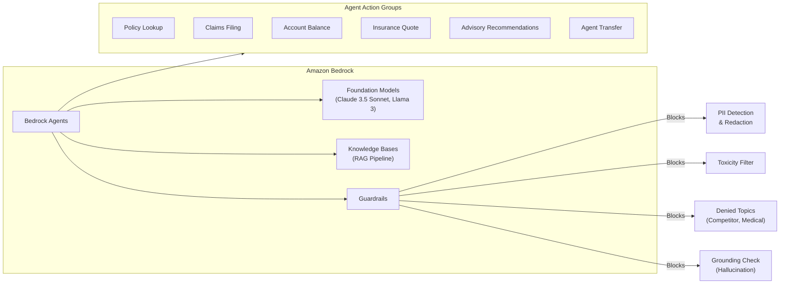
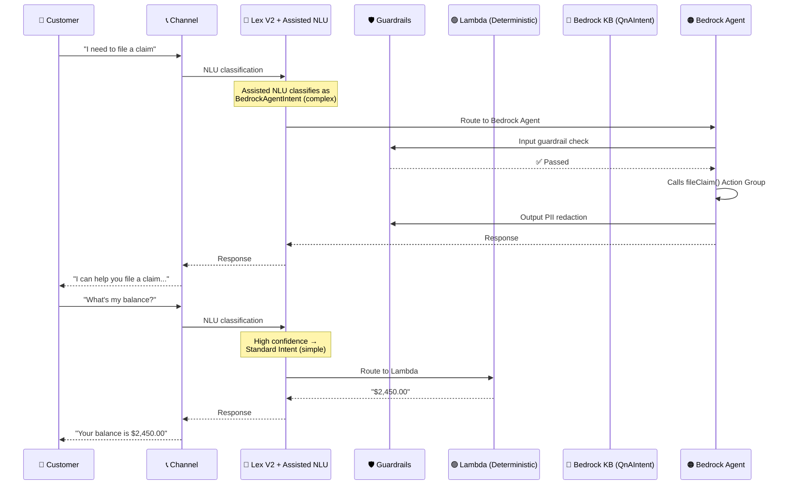

# Conversational AI Platform — System Architecture

A self-service, multi-channel Conversational AI platform for a financial services company (insurance, banking, advisory products), built on AWS with a **hybrid Lex V2 + Bedrock** architecture. The platform uses Lex V2 as the intelligent orchestrator with **three routing paths** — deterministic, knowledge, and LLM agent — choosing the right approach for each use case.

---

## Hybrid Architecture Overview

### The Three Paths

| Path | Lex V2 Intent Type | When to Use | Cost | Latency |
|------|-------------------|-------------|------|---------|
| **🟢 Deterministic** | Standard Intents + Lambda | Simple, predictable flows (check balance, activate card) | $ Low | ~200ms |
| **🔵 FAQ / Knowledge** | `QnAIntent` | Customer questions answerable from docs/FAQs | $$ Medium | ~1-2s |
| **🟠 LLM Agent** | `BedrockAgentIntent` | Complex, multi-step, reasoning-heavy conversations | $$$ Higher | ~2-5s |

---

## ① Channel Layer — Voice & Text

All customer interactions enter through unified channels and converge into Lex V2.

| Channel | AWS Service | Details |
|---------|-------------|---------|
| **Voice** | **Amazon Connect** | IVR flows, real-time transcription via Contact Lens, warm transfer to live agents |
| **Web/Mobile Chat** | **Amazon Connect Chat** or custom via API Gateway WebSocket | Rich UI, file attachments, persistent sessions |
| **SMS** | **Amazon Pinpoint** | Two-way SMS for notifications, simple Q&A |

---

## ② Amazon Lex V2 — The Intelligent Orchestrator

Lex V2 sits at the center of the architecture. It is **not** just a traditional ML classifier — with its LLM-enhanced features, it becomes a smart router that picks the right path for each conversation.

### Lex V2 LLM-Enhanced Features

#### Assisted NLU (LLM-Enhanced Classification)

Lex V2's **Assisted NLU** uses Bedrock LLMs behind the scenes to improve intent classification:

- **Primary mode:** LLM is the main processor — best semantic understanding
- **Fallback mode:** LLM activates only when traditional NLU has low confidence — cost-optimized
- Handles spelling errors, verbose inputs, complex utterances without exhaustive training data
- Works within the bot's configured intents — the LLM helps classify, not replace the intent structure

#### Standard Intents — Deterministic Path 🟢

For **simple, predictable** interactions that don't need LLM reasoning:

| Intent | Slots | Fulfillment | Why Deterministic? |
|--------|-------|-------------|-------------------|
| `CheckBalance` | AccountId | Lambda → Banking API | Simple lookup, no reasoning needed |
| `ActivateCard` | CardLast4, DOB | Lambda → Card API | Procedural, step-by-step |
| `PaymentStatus` | PaymentId | Lambda → Payments API | Direct DB lookup |
| `TransferToAgent` | Department | Connect transfer | Simple routing |

**Benefits:** Fast (~200ms), cheap (no LLM tokens), predictable, easy to test.

#### QnAIntent — Knowledge Path 🔵

For **customer questions** answerable from product documentation, FAQs, and policy documents:

- Powered by **Bedrock Knowledge Bases** (RAG)
- Searches vectorized documents in **OpenSearch Serverless**
- Generates grounded answers using Bedrock foundation model
- **No custom Lambda needed** — Lex handles it natively
- Sources: product docs, policy PDFs, rate sheets, compliance FAQs

#### BedrockAgentIntent — LLM Agent Path 🟠

For **complex, multi-step conversations** that require reasoning, tool calling, and dynamic decision-making:

- Bedrock Agent handles the entire conversation — reasoning, clarifying, executing
- **Action Groups** define the tools the agent can call (backend APIs wrapped as Lambda functions)
- **Guardrails** enforce PII redaction, denied topics, grounding checks
- Used for: claims filing, advisory conversations, complex product comparisons, dispute resolution

---

## ③ How Lex V2 Routes Between Paths — Decision Logic

**Fallback strategy:** Even the `FallbackIntent` can be configured to route to a Bedrock Agent as a graceful catch-all, so the customer never hits a dead end.

---

## ④ LLM Orchestration — Amazon Bedrock

All LLM capabilities flow through **Amazon Bedrock** — used by Lex V2 (Assisted NLU, QnAIntent) and directly by Bedrock Agents.

| Concern | Solution |
|---------|----------|
| **Model selection** | Claude 3.5 Sonnet (primary), Llama 3 (cost-sensitive fallback) — configurable per use case |
| **Safety** | Bedrock Guardrails: PII redaction, toxicity filtering, denied topic blocking, grounding checks |
| **Knowledge retrieval** | Bedrock Knowledge Bases with OpenSearch Serverless vector store |
| **Complex workflows** | Bedrock Agents with Action Groups calling backend Lambdas |
| **Multi-step flows** | AWS Step Functions for stateful processes (e.g., claims filing) |

> ⚠️ **Financial Compliance:** All Bedrock model invocation logs MUST be enabled and stored in S3 with encryption. Guardrails must block financial advice that could constitute unauthorized advisory services.

---

## ⑤ Knowledge & Data Layer

| Store | Purpose | Key Details |
|-------|---------|-------------|
| **S3** | Document corpus | Product docs, policy PDFs, FAQs — per LOB prefix |
| **OpenSearch Serverless** | Vector embeddings | Bedrock Titan Embeddings V2; auto-scaled |
| **DynamoDB — Sessions** | Conversation state | Customer context, slot values, escalation history; TTL auto-cleanup |
| **DynamoDB — Use Case Registry** | Intent config | Maps intent → path (deterministic/knowledge/agent), model, guardrail profile |
| **DynamoDB — Conversation History** | Audit trail | Full conversation logs for compliance + analytics |

---

## ⑥ Backend Services

| Service | Role |
|---------|------|
| **API Gateway** | REST + WebSocket endpoints for chat clients |
| **AWS Lambda** | Fulfillment functions — deterministic intents + Bedrock Agent action groups |
| **AWS Step Functions** | Multi-step workflow orchestration (claims, applications) |
| **Amazon EventBridge** | Event bus for async processing and decoupling |
| **Amazon SQS** | Async task queues (document processing, notifications) |

---

## ⑦ Use Case Routing Examples by LOB

| LOB | Use Case | Path | Why? |
|-----|----------|------|------|
| **Banking** | Check account balance | 🟢 Deterministic | Simple lookup, no reasoning |
| **Banking** | Activate new card | 🟢 Deterministic | Step-by-step procedural |
| **Insurance** | "What does my policy cover?" | 🔵 QnAIntent | FAQ — answer from policy docs |
| **Insurance** | "How do deductibles work?" | 🔵 QnAIntent | General knowledge question |
| **Insurance** | File a car accident claim | 🟠 BedrockAgent | Complex multi-step, needs reasoning |
| **Banking** | Dispute a charge | 🟠 BedrockAgent | Requires investigation, multi-turn |
| **Advisory** | Retirement planning Q&A | 🟠 BedrockAgent | Nuanced, needs guardrails for compliance |
| **Advisory** | Schedule appointment | 🟢 Deterministic | Simple booking, slot filling |

---

## End-to-End Request Flow

---

## AWS Services Summary

| Category | Services |
|----------|----------|
| **Channels** | Amazon Connect, Connect Chat, Pinpoint |
| **NLU & Orchestration** | Amazon Lex V2 (Assisted NLU, QnAIntent, BedrockAgentIntent) |
| **LLM/AI** | Amazon Bedrock (Models, Agents, Knowledge Bases, Guardrails) |
| **Compute** | AWS Lambda, Step Functions |
| **Data** | DynamoDB, S3, OpenSearch Serverless |
| **API** | API Gateway (REST + WebSocket) |
| **Events** | EventBridge, SQS, Kinesis Firehose |
| **Observability** | CloudWatch, X-Ray, Athena, QuickSight |
| **Security** | Cognito, WAF, KMS, CloudTrail, IAM, VPC |
| **IaC** | Terraform (infra), CDK (use case onboarding) |
| **CI/CD** | **GitLab CI/CD** |

---

## Related Documents

- [Onboarding Pipeline](02-onboarding-pipeline.md) — GitLab CI/CD, Terraform + CDK, YAML specs
- [Observability](03-observability.md) — 3-tier observability strategy
- [Security & Compliance](04-security-compliance.md) — Security, PII, compliance frameworks
