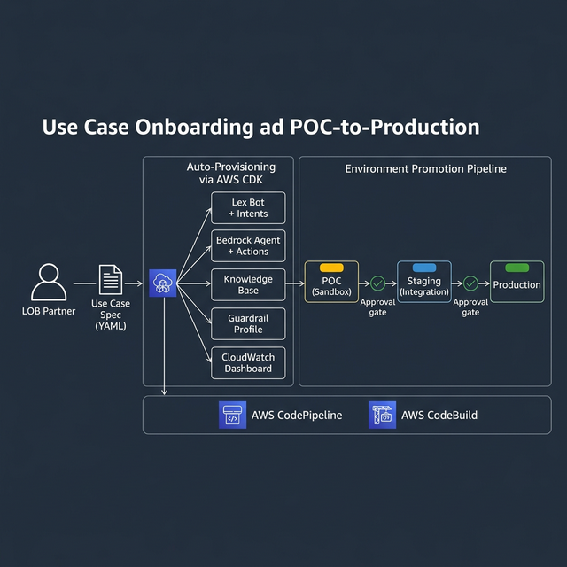
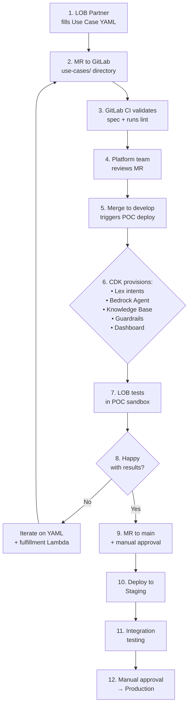

# Use Case Onboarding & POC-to-Production Pipeline

This document describes how any LOB (Line-of-Business) partner can bring a new conversational AI use case from idea to production with minimal code.

---

## Overview



---

## Design Principles

1. **Config-driven, not code-driven** — new intents and use cases are defined via YAML specs, not custom code
2. **Self-service** — LOB partners fill out a spec, platform auto-provisions everything
3. **Fast iteration** — POC in days, not weeks
4. **Safe promotion** — approval gates between POC → Staging → Production
5. **Consistent infrastructure** — Terraform for base infra, CDK for use-case-specific provisioning

---

## IaC Strategy: Terraform + CDK

| Layer | Tool | What It Manages |
|-------|------|-----------------|
| **Base Platform Infrastructure** | **Terraform** | VPC, networking, shared DynamoDB tables, OpenSearch cluster, S3 buckets, IAM roles, Connect instance, shared Lex bot, API Gateway, CloudWatch log groups |
| **Use Case Provisioning** | **AWS CDK** | Per-use-case Lex intents/slots, Bedrock Agent + Action Groups, Knowledge Base data sources, Guardrail profiles, per-use-case Lambda stubs, CloudWatch dashboards |

> **Why CDK for use case onboarding?** CDK allows programmatic generation of infrastructure from the YAML spec. The platform CLI reads the use case YAML and dynamically generates CDK constructs — something Terraform's static HCL isn't ideal for.

---

## CI/CD: GitLab

All code and configuration lives in **GitLab** repositories.

### Repository Structure

```
conversational-ai-platform/
├── infra/                          # Terraform — base infrastructure
│   ├── modules/
│   │   ├── networking/
│   │   ├── connect/
│   │   ├── lex/
│   │   ├── bedrock/
│   │   ├── dynamodb/
│   │   ├── opensearch/
│   │   └── observability/
│   ├── environments/
│   │   ├── poc/
│   │   ├── staging/
│   │   └── prod/
│   └── main.tf
├── platform/                       # Platform CLI & CDK app
│   ├── cli/                        # Python CLI for onboarding
│   ├── cdk/                        # CDK stacks for use case provisioning
│   └── templates/                  # Lambda fulfillment templates
├── use-cases/                      # Use case specs (YAML)
│   ├── insurance/
│   │   ├── auto-quote.yaml
│   │   ├── claims-status.yaml
│   │   └── policy-renewal.yaml
│   ├── banking/
│   │   ├── account-balance.yaml
│   │   └── dispute-charge.yaml
│   └── advisory/
│       └── schedule-appointment.yaml
├── lambdas/                        # Fulfillment Lambda functions
│   ├── shared/                     # Shared utilities
│   ├── insurance/
│   ├── banking/
│   └── advisory/
├── tests/                          # Test harnesses
│   ├── integration/
│   └── conversation/               # Simulated conversation tests
├── .gitlab-ci.yml                  # GitLab CI/CD pipeline
└── docs/                           # Architecture docs (this folder)
```

### GitLab CI/CD Pipeline (`.gitlab-ci.yml`)

```yaml
stages:
  - validate
  - build
  - deploy-poc
  - test-poc
  - deploy-staging
  - test-staging
  - deploy-prod

variables:
  TF_ROOT: infra
  CDK_ROOT: platform/cdk

# ─── Stage 1: Validate ───────────────────────────────────
validate-use-case-spec:
  stage: validate
  script:
    - python platform/cli/validate_spec.py use-cases/**/*.yaml
    - terraform -chdir=$TF_ROOT validate
    - cd $CDK_ROOT && npx cdk synth --quiet
  rules:
    - if: $CI_MERGE_REQUEST_ID

lint-and-test:
  stage: validate
  script:
    - pytest tests/ -v
    - pylint lambdas/ --fail-under=8

# ─── Stage 2: Build ──────────────────────────────────────
build-lambdas:
  stage: build
  script:
    - ./scripts/build-lambdas.sh
  artifacts:
    paths:
      - dist/lambdas/

# ─── Stage 3: Deploy to POC ──────────────────────────────
deploy-poc-infra:
  stage: deploy-poc
  script:
    - terraform -chdir=$TF_ROOT/environments/poc apply -auto-approve
    - cd $CDK_ROOT && npx cdk deploy --all --context env=poc --require-approval never
  environment:
    name: poc
  rules:
    - if: $CI_COMMIT_BRANCH == "develop"

# ─── Stage 4: Test POC ───────────────────────────────────
test-poc:
  stage: test-poc
  script:
    - python tests/conversation/run_simulations.py --env poc
    - python tests/integration/run_tests.py --env poc
  environment:
    name: poc

# ─── Stage 5: Deploy to Staging ──────────────────────────
deploy-staging:
  stage: deploy-staging
  script:
    - terraform -chdir=$TF_ROOT/environments/staging apply -auto-approve
    - cd $CDK_ROOT && npx cdk deploy --all --context env=staging --require-approval never
  environment:
    name: staging
  rules:
    - if: $CI_COMMIT_BRANCH == "main"
  when: manual  # Approval gate

# ─── Stage 6: Test Staging ────────────────────────────────
test-staging:
  stage: test-staging
  script:
    - python tests/conversation/run_simulations.py --env staging
    - python tests/integration/run_tests.py --env staging
  environment:
    name: staging

# ─── Stage 7: Deploy to Production ───────────────────────
deploy-prod:
  stage: deploy-prod
  script:
    - terraform -chdir=$TF_ROOT/environments/prod apply -auto-approve
    - cd $CDK_ROOT && npx cdk deploy --all --context env=prod --require-approval never
  environment:
    name: production
  rules:
    - if: $CI_COMMIT_BRANCH == "main"
  when: manual  # Approval gate — requires senior approval
```

---

## Use Case Specification Format

LOB partners define their use case in a YAML file:

```yaml
use_case:
  name: "auto-insurance-quote"
  lob: "insurance"
  description: "Get auto insurance quotes via chat or voice"
  owner: "insurance-digital-team"
  
  intents:
    - name: GetAutoQuote
      sample_utterances:
        - "I need a car insurance quote"
        - "How much is auto insurance?"
        - "Get me a quote for my vehicle"
        - "I want to insure my car"
      slots:
        - name: VehicleYear
          type: AMAZON.Number
          prompt: "What year is your vehicle?"
          required: true
        - name: VehicleMake
          type: AMAZON.AlphaNumeric
          prompt: "What is the make of your vehicle?"
          required: true
        - name: VehicleModel
          type: AMAZON.AlphaNumeric
          prompt: "What is the model?"
          required: true
        - name: ZipCode
          type: AMAZON.Number
          prompt: "What is your zip code?"
          required: true

  knowledge_sources:
    - s3://company-docs/insurance/auto-policies/
    - s3://company-docs/insurance/coverage-faqs/

  fulfillment:
    type: lambda
    handler: insurance/auto_quote_handler
    backend_api: "https://api.internal/insurance/v2/quotes"

  guardrails:
    pii_redaction: true
    denied_topics:
      - "competitor_products"
      - "medical_advice"
      - "investment_advice"
    grounding_check: true

  model:
    primary: anthropic.claude-3-5-sonnet
    fallback: meta.llama3-70b-instruct

  channels:
    - voice
    - chat

  environment: poc
```

---

## Onboarding Workflow

### Step-by-Step Process



### Timeline

| Phase | Duration | What Happens |
|-------|----------|--------------|
| **Spec & Config** | 1–2 days | LOB fills use case YAML, platform team reviews |
| **POC Deploy** | 1–3 days | CDK auto-provisions sandbox; LOB writes fulfillment Lambda |
| **POC Testing** | 1–2 weeks | LOB tests with internal users, reviews analytics |
| **Staging Promotion** | 1 day | Merge to main, manual approval, integration testing |
| **Prod Release** | 1 day | Final approval gate, production deploy |

---

## Adding a New Intent to an Existing Use Case

For simple additions (e.g., adding a "CheckPaymentStatus" intent to banking):

1. Edit `use-cases/banking/account-balance.yaml` — add the new intent block
2. Create/update the fulfillment Lambda in `lambdas/banking/`
3. Submit MR → CI validates → review → merge → auto-deploy
4. **No infra changes needed** — CDK detects the diff and adds only the new intent

---

## Platform CLI Commands

```bash
# Validate a use case spec
platform validate use-cases/insurance/auto-quote.yaml

# Preview what CDK will provision (dry run)
platform preview use-cases/insurance/auto-quote.yaml --env poc

# Generate Lambda fulfillment stub from spec
platform scaffold use-cases/insurance/auto-quote.yaml

# Run conversation simulation tests
platform test use-cases/insurance/auto-quote.yaml --env poc

# View use case analytics dashboard
platform dashboard insurance/auto-quote --env prod
```
