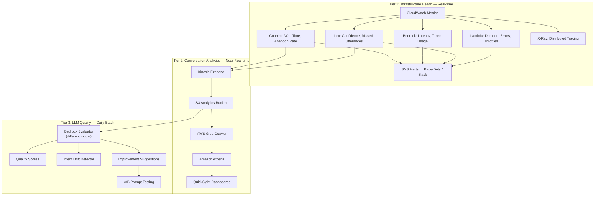
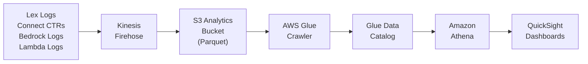
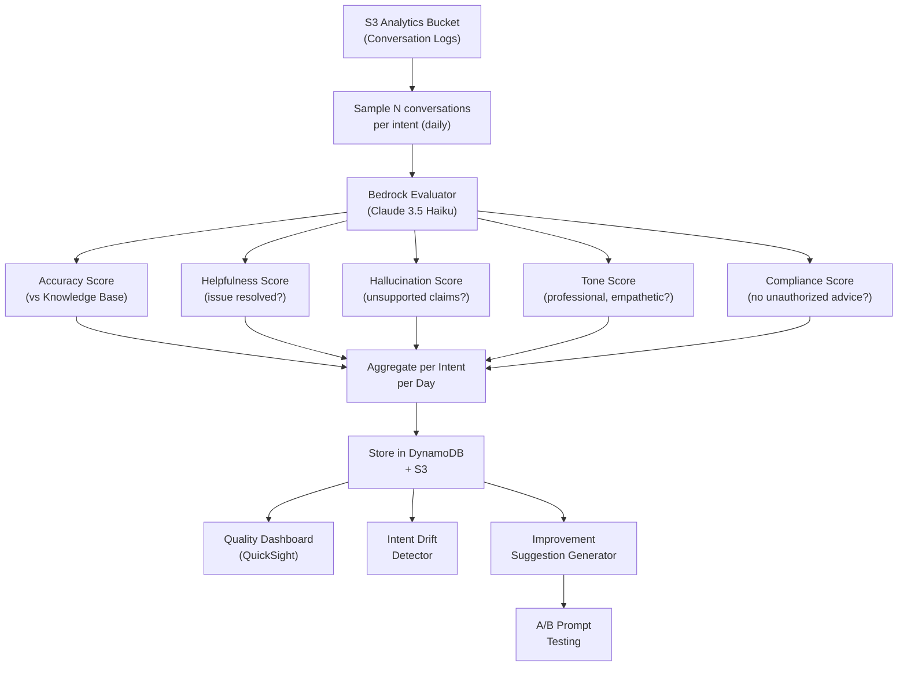

# Observability — 3-Tier Strategy

Full-stack observability for the Conversational AI platform. Three tiers provide progressively deeper insights: infrastructure health, conversation analytics, and LLM-powered quality evaluation.

---

## Architecture Overview



---

## Tier 1 — Infrastructure Health (Real-time)

Monitors the health of AWS services powering the platform. Alerts fire automatically via SNS to Slack/PagerDuty.

### Key Metrics & Alerts

| Metric | Source | Alert Threshold | Action |
|--------|--------|-----------------|--------|
| Lambda error rate | CloudWatch | > 1% errors over 5 min | SNS → on-call |
| Lambda duration P99 | CloudWatch | > 10s | Review cold starts |
| Lex intent confidence | Lex Logs | < 0.6 average confidence | Route to utterance review queue |
| Bedrock latency P99 | CloudWatch | > 5s | Check model, consider fallback |
| Bedrock throttles | CloudWatch | > 0 | Request quota increase |
| Connect abandon rate | Connect Metrics | > 10% | Capacity + IVR review |
| Guardrail block rate | Bedrock Logs | Spike > 2x baseline | Review blocked conversations |
| API Gateway 5xx | CloudWatch | > 0.5% | Investigate backend |

### Distributed Tracing (AWS X-Ray)

Every request is traced end-to-end:

```
Customer → API Gateway → Lex → Router Lambda → Bedrock Agent → Fulfillment Lambda → DynamoDB
                                                    ↓
                                              Knowledge Base → OpenSearch
```

X-Ray service map shows latency breakdown per hop, helping identify bottlenecks.

### CloudWatch Dashboard — Platform Health

```
┌─────────────────────────────────────────────────────────────────┐
│  PLATFORM HEALTH DASHBOARD                                       │
├───────────────────┬───────────────────┬─────────────────────────┤
│ Lambda Errors     │ Bedrock Latency   │ Connect Abandon Rate    │
│ ▁▁▃▁▁▁▁▁▁▁      │ ▂▂▂▃▃▂▂▂▂▂       │ ▁▁▁▁▁▁▁▁▁▂            │
│ 0.2% (✅ OK)     │ P99: 2.1s (✅ OK) │ 4.2% (✅ OK)           │
├───────────────────┼───────────────────┼─────────────────────────┤
│ Lex Confidence    │ Guardrail Blocks  │ Active Conversations    │
│ ▇▇▇▆▇▇▇▇▇▇      │ ▁▁▁▁▂▁▁▁▁▁       │ ████████░░              │
│ Avg: 0.87 (✅)   │ 23 today (✅)     │ 847 active              │
└───────────────────┴───────────────────┴─────────────────────────┘
```

---

## Tier 2 — Conversation & Intent Analytics (Near Real-time)

### Data Pipeline



### Per-Intent Metrics

Every intent is tracked with the following KPIs:

| Metric | Definition | Target |
|--------|-----------|--------|
| **Containment Rate** | % of conversations resolved without human escalation | > 80% |
| **Completion Rate** | % of users who complete the flow vs. abandon | > 70% |
| **Fallback Rate** | % of utterances hitting the fallback intent | < 10% |
| **Avg Turns to Resolution** | Number of conversation turns to resolve | < 5 |
| **CSAT Score** | Post-chat survey (1–5 via Connect) | > 4.0 |
| **Cost per Conversation** | Bedrock token cost + Lambda invocations | Track trend |
| **Channel Distribution** | Voice vs. Chat vs. SMS breakdown | Informational |

### QuickSight Dashboards

**Dashboard 1 — Intent Performance (per LOB)**
- Intent heatmap showing containment rate by intent and LOB
- Weekly trend lines for each KPI
- Top movers: intents with biggest improvement/decline this week

**Dashboard 2 — Utterance Analysis**
- Top 20 missed utterances (for Lex training improvement)
- Utterance-to-intent mapping accuracy
- New utterance clusters detected (potential new intents)

**Dashboard 3 — Cost & Volume**
- Conversations per day by LOB and channel
- Bedrock token usage and cost by intent
- Lambda invocation cost by fulfillment function
- Projected monthly cost at current trajectory

---

## Tier 3 — LLM-Powered Quality Evaluation (Daily Batch)

This tier uses **Bedrock itself** to evaluate the quality of conversations. It runs as a daily batch job.

### How It Works



> **Important:** The evaluator uses a **different model** than production (e.g., if prod uses Claude 3.5 Sonnet, evaluator uses Claude 3.5 Haiku) to avoid self-evaluation bias.

### Evaluation Prompt Template

```text
You are evaluating a customer service conversation for a financial services company.

CONVERSATION:
{conversation_transcript}

KNOWLEDGE BASE CONTEXT:
{relevant_kb_articles}

Rate the following on a scale of 1-5:

1. ACCURACY: Does the agent's response match the knowledge base information?
2. HELPFULNESS: Did the agent resolve the customer's issue?
3. HALLUCINATION: Did the agent make any claims not supported by the knowledge base?
4. TONE: Was the agent professional, empathetic, and appropriate?
5. COMPLIANCE: Did the agent avoid giving unauthorized financial/investment advice?

For each rating, provide a brief justification.
Also identify any specific improvements the agent's prompt could make.
```

### Intent Drift Detection

The drift detector identifies when an intent's quality scores decline over time:

- **Trigger:** 3+ consecutive days of accuracy score decline (> 0.3 drop)
- **Alert:** Sends notification to LOB owner via Slack/email
- **Suggested causes:** Knowledge base articles outdated, new product not yet documented, prompt needs refinement

### A/B Prompt Testing

When the suggestion generator recommends a prompt change:

1. **Variant creation:** New prompt variant is created alongside the current one
2. **Shadow testing:** The same conversations are replayed through both prompts
3. **Scoring:** Both responses are scored by the LLM evaluator
4. **Report:** Side-by-side comparison with confidence intervals
5. **Decision:** Platform team approves or rejects the new prompt

```
┌──────────────────────────────────────────────────────────┐
│  A/B PROMPT TEST REPORT — GetAutoQuote                    │
├──────────────────────┬───────────────────────────────────┤
│  Metric              │ Prompt A (current) │ Prompt B (new)│
├──────────────────────┼────────────────────┼──────────────┤
│  Accuracy            │ 4.1                │ 4.5 (+0.4)   │
│  Helpfulness         │ 3.8                │ 4.2 (+0.4)   │
│  Hallucination       │ 4.6                │ 4.7 (+0.1)   │
│  Tone                │ 4.3                │ 4.4 (+0.1)   │
│  Compliance          │ 4.9                │ 4.9 (same)   │
├──────────────────────┼────────────────────┼──────────────┤
│  Overall             │ 4.34               │ 4.54 (+0.20) │
│  Confidence          │                    │ 95% CI       │
│  Recommendation      │ → ADOPT Prompt B                  │
└──────────────────────┴───────────────────────────────────┘
```

---

## GitLab Integration for Observability

### Automated Quality Reports in MRs

When a use case YAML is updated, the GitLab CI pipeline runs conversation simulations and posts a quality report as an MR comment:

```yaml
# In .gitlab-ci.yml
quality-report:
  stage: test-poc
  script:
    - python platform/cli/quality_report.py --use-case $CHANGED_USE_CASE --env poc
  artifacts:
    reports:
      metrics: quality-metrics.txt
```

### Scheduled Quality Pipeline

```yaml
# Nightly quality evaluation
quality-evaluation:
  stage: .post
  script:
    - python platform/cli/run_evaluation.py --env prod --sample-size 100
    - python platform/cli/drift_detection.py --env prod
    - python platform/cli/generate_suggestions.py --env prod
  rules:
    - if: $CI_PIPELINE_SOURCE == "schedule"
  artifacts:
    paths:
      - reports/
```
