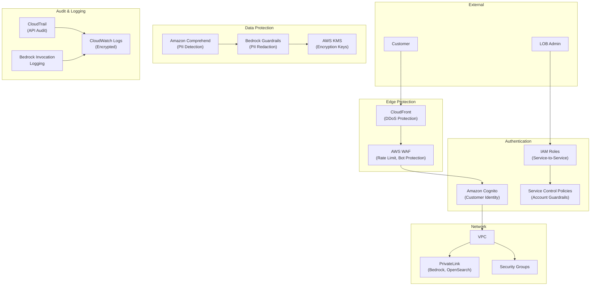
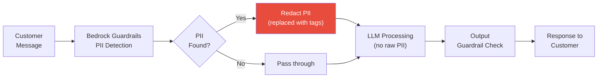

# Security & Compliance

Security and compliance architecture for the Conversational AI platform, designed for a regulated financial services environment.

---

## Security Architecture



---

## Control Matrix

| Control Area | AWS Service | Implementation |
|-------------|-------------|----------------|
| **Identity — Customers** | Amazon Cognito | User pools with MFA, social/enterprise federation |
| **Identity — Admins** | IAM + SSO | SAML federation with corporate IdP; MFA enforced |
| **Identity — Services** | IAM Roles | Least-privilege execution roles per Lambda |
| **API Protection** | AWS WAF | Rate limiting (100 req/min per IP), geo-blocking, bot detection |
| **DDoS** | CloudFront + Shield Standard | Edge protection for chat endpoints |
| **Encryption at Rest** | AWS KMS | All S3, DynamoDB, OpenSearch encrypted with CMKs |
| **Encryption in Transit** | TLS 1.2+ | All API endpoints, service-to-service calls |
| **PII Detection** | Bedrock Guardrails + Comprehend | SSN, account numbers, DOB auto-detected and redacted |
| **Content Safety** | Bedrock Guardrails | Toxicity filtering, denied topic blocking |
| **Hallucination Prevention** | Bedrock Guardrails | Grounding checks against knowledge base |
| **Network Isolation** | VPC + PrivateLink | Bedrock and OpenSearch accessed via private endpoints only |
| **API Audit** | CloudTrail | All API calls logged with 90-day retention |
| **Model Audit** | Bedrock Invocation Logging | Full input/output logging to encrypted S3 |
| **Conversation Audit** | DynamoDB + S3 | Full conversation history for regulatory review |
| **Account Governance** | Organizations + SCP | Prevent resource creation outside approved regions |

---

## PII Handling Pipeline

Financial data requires strict PII handling:



**PII types detected and redacted:**
- Social Security Numbers (SSN)
- Credit card numbers
- Bank account numbers
- Date of birth
- Driver's license numbers
- Email addresses and phone numbers (configurable — sometimes needed)

---

## Compliance Considerations

| Framework | Relevance | Key Requirements |
|-----------|-----------|------------------|
| **SOC 2 Type II** | All services | Audit logging, access controls, encryption, monitoring |
| **PCI DSS** | Banking/payments | Card data never stored in Bedrock; tokenized before LLM |
| **GLBA** | Financial data | Customer data privacy, safeguards, notification |
| **State Insurance Regs** | Insurance LOB | Disclaimers in auto-generated quotes, no unauthorized advice |

### Key Compliance Patterns

1. **Bedrock Guardrails** enforce that the AI never provides unauthorized financial advice
2. **All model invocations are logged** — full input/output stored in encrypted S3 for audit
3. **Conversation recordings** (Connect Contact Lens) stored with encryption and retention policies
4. **Data residency** — all data stays in approved AWS region (e.g., us-east-1)
5. **Right to delete** — customer conversation data can be purged via automated cleanup jobs

---

## IAM Role Strategy

```
Platform Roles:
├── platform-admin           # Full platform access (infra team only)
├── lob-admin-{lob}          # LOB-scoped admin (manages their use cases only)
├── lob-readonly-{lob}       # LOB dashboards and analytics (read-only)
├── lambda-exec-{function}   # Per-function execution role (least privilege)
├── bedrock-invoke            # Bedrock model invocation (scoped to approved models)
├── lex-manage-{lob}          # Lex bot management (scoped to LOB bot alias)
└── ci-deploy-{env}           # GitLab CI service account (per environment)
```

> **Principle:** Every LOB partner gets scoped IAM roles — they can only see and manage their own use cases, intents, dashboards, and analytics.
