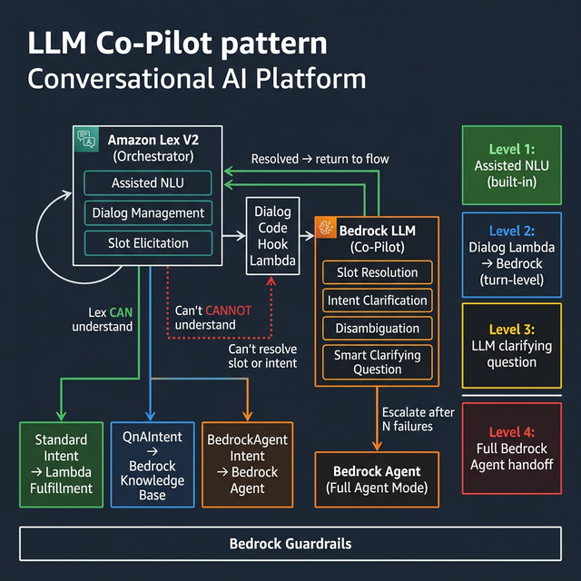
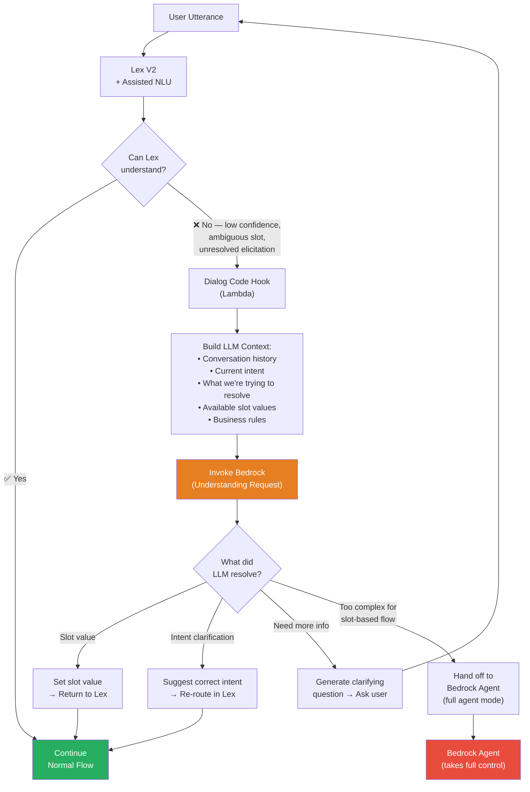
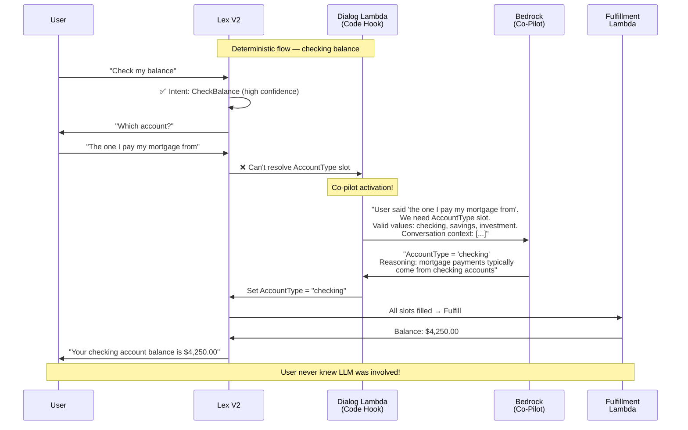
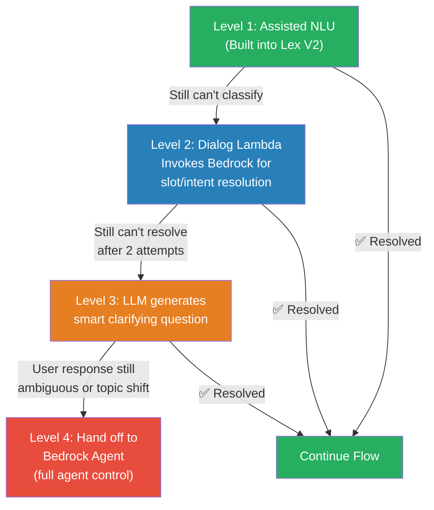
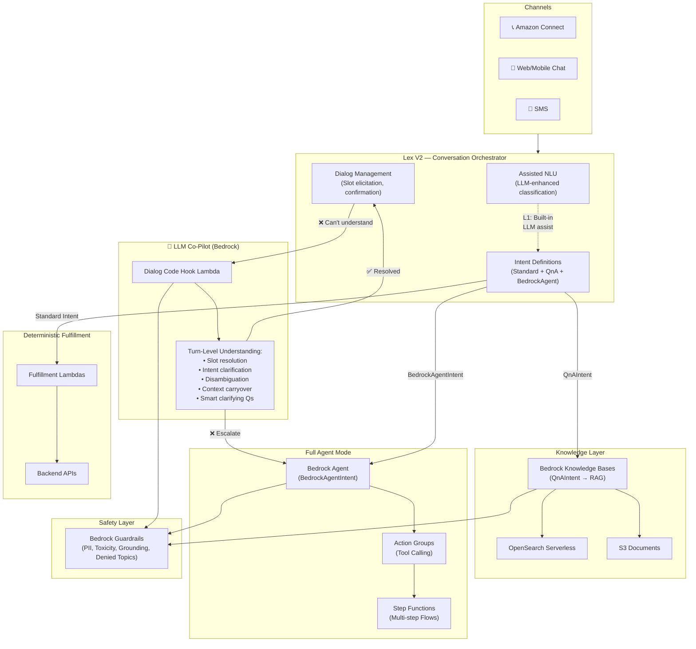

# LLM Co-Pilot Architecture — Brainstorm



## The Paradigm Shift

**Old thinking:** Three separate paths — deterministic, knowledge, agent — picked at the start based on task complexity.

**New thinking:** The LLM is not a separate path. It's an **always-available co-pilot** that any part of the system can invoke when it needs help understanding the user.

```
┌────────────────────────────────────────────────────────────┐
│  "The LLM is not a destination. It's a capability."        │
│                                                            │
│  Any turn, any slot, any point in the conversation —       │
│  if the system can't understand the user, it asks the LLM. │
│  The LLM understands, and hands control back.              │
└────────────────────────────────────────────────────────────┘
```

---

## The Problem We're Solving

**Scenario:** Deterministic path — checking account balance.

```
Lex:   "Which account would you like to check?"  (eliciting AccountType slot)
User:  "The one I usually pay my electric bill from"
Lex:   ??? (can't map this to a slot value like "checking" or "savings")
```

**Old approach:** Lex fails → FallbackIntent → conversation breaks or fully hands off to LLM Agent (overkill).

**New approach:** Lex fails to elicit the slot → **Dialog Lambda invokes Bedrock** → Bedrock understands "the bill-paying account = checking account" → Lambda returns the resolved slot to Lex → Deterministic flow continues.

The user never notices. The conversation stays in the deterministic flow. The LLM was a silent co-pilot for one turn.

---

## Architecture: LLM as a Turn-Level Co-Pilot



---

## When Does the Co-Pilot Activate?

The co-pilot isn't about simple vs complex. It activates based on **understanding failures at specific points:**

| Trigger Point | What Fails | What LLM Does | Example |
|--------------|-----------|---------------|---------|
| **Intent Classification** | Lex can't match to any intent (low confidence) | Understands utterance semantically, suggests correct intent | "I think there's something wrong with my charges" → DisputeCharge intent |
| **Slot Elicitation** | User gives an ambiguous or indirect answer to a slot prompt | Resolves the natural language to a valid slot value | "The one I pay bills from" → AccountType = "checking" |
| **Slot Validation** | User provides a value that doesn't match expected format/type | Interprets and normalizes the value | "Twenty-five hundred" → Amount = 2500 |
| **Disambiguation** | Multiple intents could match | Asks a smart clarifying question | "Is this about your homeowner's or auto policy?" |
| **Mid-flow Confusion** | User changes topic or asks a side question mid-flow | Decides: answer the side question and resume, or re-route | User mid-claim: "Wait, am I even covered for this?" |
| **Context Carryover** | User refers to something mentioned earlier | Resolves references from conversation history | "Use the same address" → pulls address from earlier turn |

---

## The Dialog Lambda — The Bridge

The **Dialog Code Hook Lambda** is the key piece. It sits between Lex and Bedrock and acts as the bridge:



### What the Dialog Lambda Sends to Bedrock

```json
{
  "request_type": "slot_resolution",
  "context": {
    "intent": "CheckBalance",
    "current_slot": "AccountType",
    "slot_prompt": "Which account would you like to check?",
    "valid_values": ["checking", "savings", "investment", "credit_card"],
    "user_response": "The one I pay my mortgage from",
    "conversation_history": [
      {"role": "user", "text": "Check my balance"},
      {"role": "bot", "text": "Which account would you like to check?"},
      {"role": "user", "text": "The one I pay my mortgage from"}
    ],
    "customer_context": {
      "accounts": ["checking", "savings"]
    }
  },
  "instruction": "Resolve the user's response to one of the valid slot values. If you cannot determine the value with confidence, suggest a clarifying question."
}
```

### What Bedrock Returns

```json
{
  "resolved": true,
  "slot_value": "checking",
  "confidence": 0.92,
  "reasoning": "Mortgage payments are typically made from checking accounts. Customer has a checking account.",
  "clarifying_question": null
}
```

Or when it can't resolve:

```json
{
  "resolved": false,
  "slot_value": null,
  "confidence": 0.45,
  "reasoning": "User said 'the usual one' but has both checking and savings with similar activity",
  "clarifying_question": "I see you have both a checking and savings account. Which one would you like to check?"
}
```

---

## Escalation Ladder — When Does Co-Pilot Become Full Agent?

The co-pilot doesn't always resolve things in one turn. There's an **escalation ladder:**



| Level | What Happens | Cost | Latency |
|-------|-------------|------|---------|
| **L1** | Lex Assisted NLU (automatic, built-in) | Low | ~50ms |
| **L2** | Dialog Lambda → Bedrock (single-turn understanding) | Medium | ~1-2s |
| **L3** | LLM generates clarifying question, waits for user | Medium | ~1-2s |
| **L4** | Full handoff to Bedrock Agent (takes over conversation) | Higher | ~2-5s |

**Key rule:** The system **tries to stay in the deterministic flow** as long as possible. It only escalates to full agent mode when the conversation has become too complex for turn-level LLM assistance.

---

## Revised Architecture Diagram



---

## How This Changes Use Case Onboarding

The YAML spec now needs to define **co-pilot behavior** per intent:

```yaml
use_case:
  name: "check-balance"
  lob: "banking"
  
  intents:
    - name: CheckBalance
      type: standard           # deterministic flow
      
      slots:
        - name: AccountType
          type: AMAZON.AlphaNumeric
          prompt: "Which account would you like to check?"
          valid_values: ["checking", "savings", "investment", "credit_card"]
          
          # Co-pilot config for this slot
          copilot:
            enabled: true
            resolution_hint: "Resolve casual references to account types. 'Bill-paying' = checking, 'rainy day' = savings."
            max_attempts: 2        # escalate to agent after 2 failed co-pilot resolutions
            
      copilot:
        enabled: true
        escalation_threshold: 2   # after 2 co-pilot invocations per conversation, consider full agent handoff
        
      fulfillment:
        type: lambda
        handler: banking/check_balance

    - name: FileClaimComplex
      type: bedrock_agent         # starts in full agent mode
      agent_id: "insurance-claims-agent"
      # No copilot config needed — Bedrock Agent handles everything
```

---

## Key Design Questions to Resolve

1. **Cost control** — Every co-pilot invocation costs Bedrock tokens. Should we limit co-pilot calls per conversation (e.g., max 3)?

2. **Latency budget** — Co-pilot adds ~1-2s per invocation. For voice (real-time), is this acceptable? Should voice have a stricter escalation-to-agent threshold?

3. **Context window** — How much conversation history do we pass to the co-pilot? Full history or last N turns?

4. **Learning loop** — When the co-pilot resolves a slot successfully, should we feed that back as training data for Lex (so next time Lex handles it natively)?

5. **Observability** — Should co-pilot invocations be tracked as a separate metric tier? (How often is the co-pilot saving conversations vs. just adding latency?)
