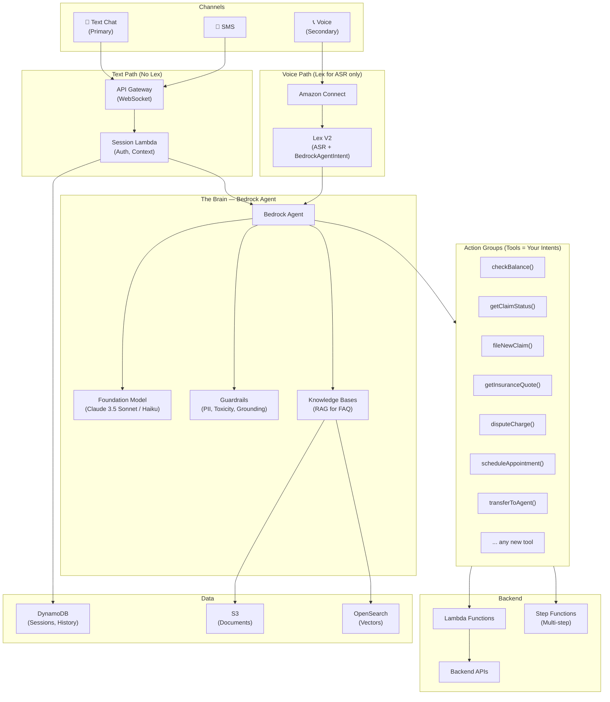

# Architecture Honest Re-Evaluation

## The Hard Truth About the Co-Pilot Design

The co-pilot architecture is intellectually interesting, but it **fails the core requirements test**.

### Scoring Against Your Requirements

| Requirement | Co-Pilot Architecture | Score |
|------------|----------------------|-------|
| **Text-first** | Routes text through Lex — but Lex was designed for voice (ASR). For text, Lex is an unnecessary hop | ❌ |
| **Instant POC** | Adding an intent = define Lex intent + utterances + slots + co-pilot config + dialog hook + Lambda. Too many moving parts | ❌ |
| **Simple promotion** | Must promote: Lex bot version + Lambda versions + co-pilot config + guardrail config. Too many artifacts | ⚠️ |
| **Flexible / scalable** | Co-pilot adds Dialog Lambda, resolution hints, escalation thresholds per slot. Over-engineered | ❌ |

### What I Was Over-Engineering

The co-pilot pattern was building a **custom orchestration layer on top of Lex** to compensate for Lex's limitations. But here's the thing:

> **The Bedrock Agent already IS the co-pilot.**
> 
> It already understands context. It already disambiguates. It already asks clarifying questions. 
> It already resolves slot values. It already calls tools. 
> We were building a co-pilot for a system that doesn't need one if we use the right primary brain.

---

## The Simpler Architecture: Bedrock Agent-First (Text Priority)

### For Text (Primary Channel)

```
Text Chat → API Gateway → Bedrock Agent → Tools (Lambdas) → Backend APIs
```

**That's it.** No Lex in the text path. The Bedrock Agent:
- Understands what the user wants (intent classification is built-in — it's an LLM)
- Asks clarifying questions naturally (no slot elicitation config needed)
- Calls the right tool (Action Group = your backend function)
- Handles multi-turn, context carryover, disambiguation — all natively

### For Voice (Secondary Channel)

```
Voice → Amazon Connect → Lex V2 (ASR + BedrockAgentIntent) → Same Bedrock Agent
```

Lex stays for voice because:
- Amazon Connect needs Lex for ASR (speech-to-text)
- But even for voice, Lex immediately delegates to the **same Bedrock Agent** via `BedrockAgentIntent`
- Lex is just the voice interface, not the brain

### The Key Insight

| Old Design | New Design |
|-----------|-----------|
| Lex = orchestrator + NLU for everything | Lex = voice interface only |
| Bedrock = helper called when Lex fails | **Bedrock Agent = the brain for everything** |
| Adding intent = Lex training + slots + Lambda + co-pilot config | **Adding intent = tool definition + Lambda** |
| Separate paths: deterministic, knowledge, agent | **One brain, many tools** |

---

## What "Adding a New Intent" Looks Like Now

### Before (Lex + Co-pilot): ~6 steps, multiple services

1. Define Lex intent with sample utterances
2. Define slot types and validation
3. Configure dialog code hook Lambda
4. Add co-pilot resolution hints per slot
5. Write fulfillment Lambda
6. Build, test, deploy Lex bot version

### After (Bedrock Agent-first): ~2 steps

**Step 1: Define the tool** (JSON schema in Agent Action Group)
```json
{
  "name": "checkAccountBalance",
  "description": "Check the balance of a customer's bank account. Ask for account type if not provided.",
  "parameters": {
    "accountType": {
      "type": "string",
      "description": "The type of account: checking, savings, investment, or credit_card",
      "required": true
    },
    "customerId": {
      "type": "string", 
      "description": "The customer ID (resolve from authenticated session)",
      "required": true
    }
  }
}
```

**Step 2: Write the Lambda handler**
```python
def handler(event, context):
    account_type = event['parameters']['accountType']
    customer_id = event['parameters']['customerId']
    balance = banking_api.get_balance(customer_id, account_type)
    return {"balance": balance, "account_type": account_type}
```

**Done.** The Agent:
- Knows WHEN to call this tool (from the description — no utterance training)
- Knows HOW to extract parameters (the LLM understands "the one I pay bills from" = checking)
- Handles edge cases naturally ("Which account?" if ambiguous)
- Works for text AND voice (same Agent, both channels)

---

## But What About Deterministic Efficiency?

**Valid concern:** "Not every turn needs an LLM call. Check balance is simple."

**Counter-argument:**
- The Lambda execution IS deterministic — same input = same output
- The LLM call is only for **understanding** the user (~500 tokens, ~1-2s, ~$0.0001)
- You save: Lex training time, co-pilot config, dialog hook Lambda, maintenance
- Net: slightly higher per-turn cost, **massively lower engineering cost and complexity**

**If cost is critical for high-volume simple intents:**
- Use **Claude 3.5 Haiku** as the Agent's model (very cheap, very fast)
- Or add a thin classification Lambda in front that routes truly trivial intents (recognized by keyword match) to direct Lambda, and everything else to the Agent
- But start simple. Optimize later only if metrics justify it.

---

## Updated Architecture



## What We Still Keep

| Component | Role | Still Needed? |
|-----------|------|--------------|
| **Bedrock Agent** | Brain — understanding + orchestration | ✅ Core |
| **Bedrock Guardrails** | Safety — PII, toxicity, grounding | ✅ Essential |
| **Bedrock Knowledge Bases** | RAG for FAQ/product questions | ✅ Yes |
| **Amazon Connect** | Voice telephony | ✅ For voice |
| **Lex V2** | ASR for voice + BedrockAgentIntent | ✅ Voice only |
| **Lambda** | Tool execution (your backend logic) | ✅ Yes |
| **Step Functions** | Multi-step workflows | ✅ For complex flows |
| **Lex Assisted NLU** | LLM-enhanced classification | ⚠️ Nice-to-have for voice |
| **Lex QnAIntent** | FAQ via Bedrock KB | ❌ Agent does this natively |
| **Dialog Code Hook co-pilot** | Custom LLM understanding layer | ❌ Agent handles this |

## POC-to-Prod With This Architecture

### Adding a new use case (instant POC):
1. Write tool definition (JSON) → add to Agent's Action Group
2. Write Lambda handler → deploy
3. (Optional) Add knowledge docs to S3 → sync Knowledge Base
4. **Done. Test immediately.**

### Promoting to next environment:
- GitLab MR from `develop` → `main`
- Terraform deploys the same Bedrock Agent config + Lambda to staging/prod
- **One MR. One pipeline. One approval.**
