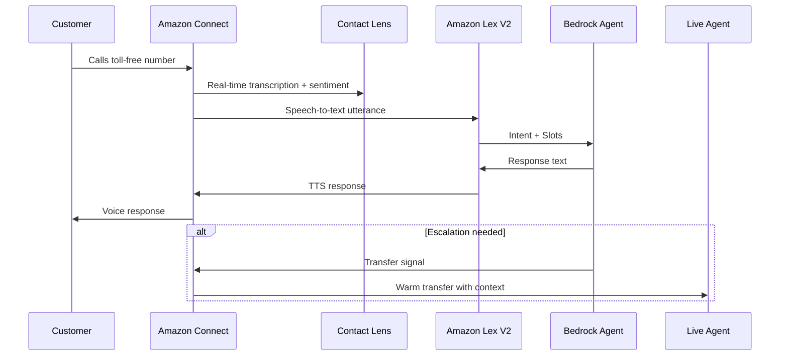
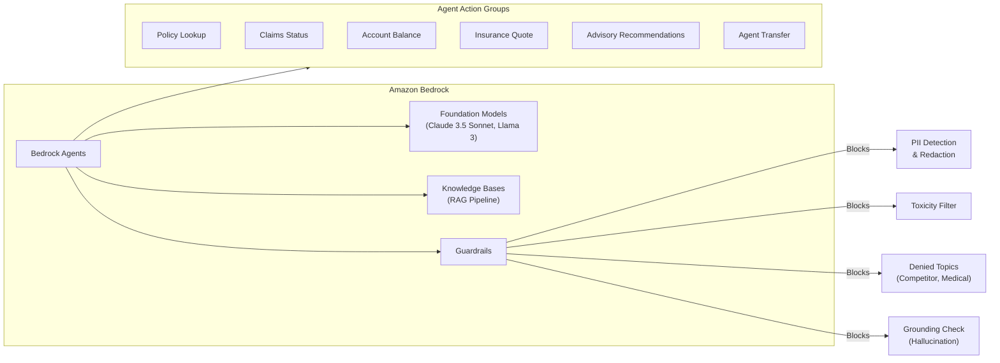
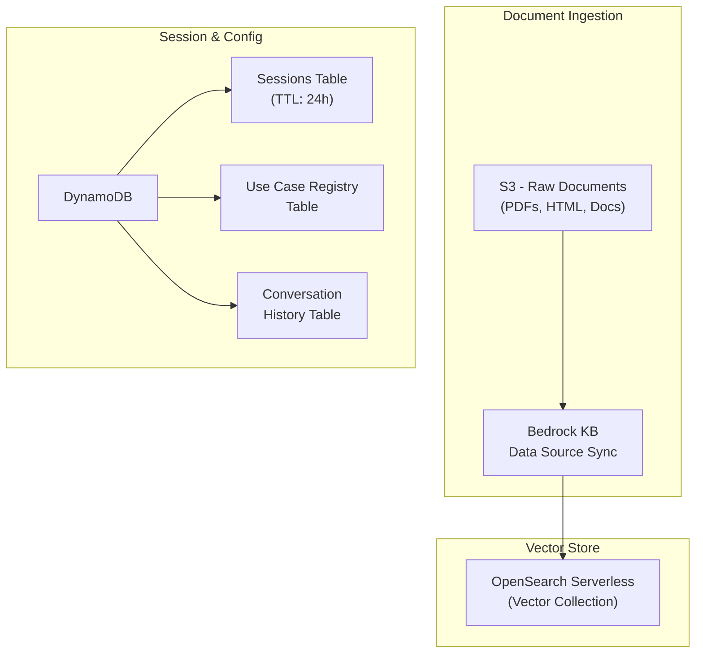
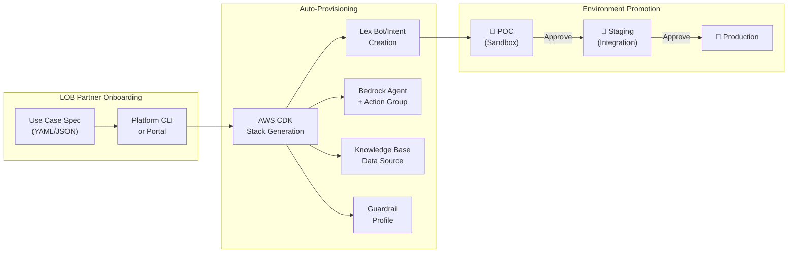
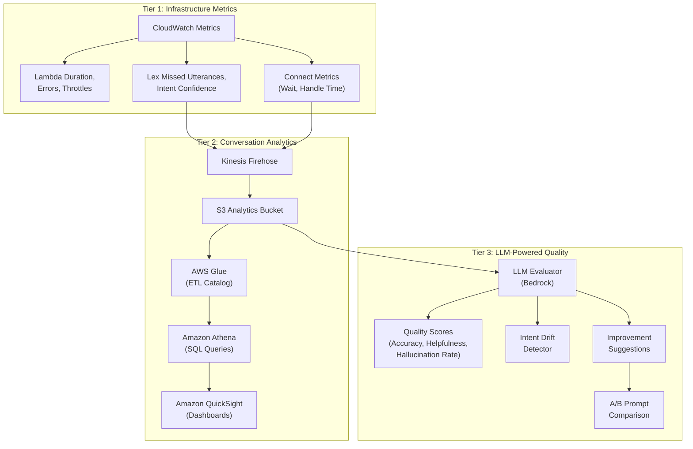
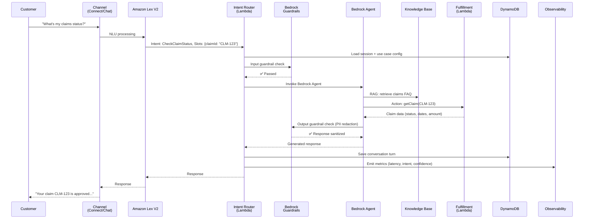

# Conversational AI Platform — System Architecture Plan

A self-service, multi-channel Conversational AI platform for a financial services company (insurance, banking, advisory products), built entirely on AWS with **Amazon Bedrock** at its core. The platform enables any Line-of-Business (LOB) partner to onboard new use cases rapidly (POC in days, prod in weeks) with minimal code.

---

## 1. High-Level Architecture Overview

```mermaid
graph TB
    subgraph Channels["① Channel Layer"]
        Voice["📞 Voice\n(Amazon Connect)"]
        WebChat["💬 Web/Mobile Chat\n(Connect Chat / Custom)"]
        SMS["📱 SMS\n(Amazon Pinpoint)"]
    end

    subgraph NLU["② NLU & Routing"]
        Lex["Amazon Lex V2\n(Intent Detection, Slots)"]
        Router["Intent Router\n(Lambda)"]
    end

    subgraph Orchestration["③ LLM Orchestration Layer"]
        Bedrock["Amazon Bedrock\n(Claude 3.5 / Llama)"]
        Agents["Bedrock Agents\n(Action Groups)"]
        Guardrails["Bedrock Guardrails\n(PII, Toxicity, Topic)"]
        StepFn["AWS Step Functions\n(Complex Flows)"]
    end

    subgraph Knowledge["④ Knowledge & Data"]
        KB["Bedrock Knowledge Bases\n(RAG)"]
        OpenSearch["OpenSearch Serverless\n(Vector Store)"]
        S3Docs["S3\n(Product Docs, FAQs)"]
        DDB["DynamoDB\n(Session, Config)"]
    end

    subgraph Backend["⑤ Backend Services"]
        API["API Gateway\n(REST / WebSocket)"]
        CoreLambda["Core Lambdas\n(Fulfillment)"]
        EventBridge["EventBridge\n(Event Bus)"]
        SQS["SQS\n(Async Processing)"]
    end

    subgraph Observability["⑥ Observability"]
        CW["CloudWatch\n(Metrics, Logs, Dashboards)"]
        XRay["X-Ray\n(Distributed Tracing)"]
        Analytics["Intent Analytics\n(Athena + QuickSight)"]
        LLMEval["LLM-Powered\nQuality Evaluator"]
    end

    subgraph DevOps["⑦ Use Case Onboarding & CI/CD"]
        Config["Use Case Config\n(S3 / DynamoDB)"]
        CDK["AWS CDK\n(IaC)"]
        Pipeline["CodePipeline\n(POC → Staging → Prod)"]
    end

    Voice --> Lex
    WebChat --> API --> Lex
    SMS --> Lex
    Lex --> Router
    Router --> Agents
    Agents --> Bedrock
    Agents --> Guardrails
    Agents --> KB
    KB --> OpenSearch
    KB --> S3Docs
    Agents --> StepFn
    StepFn --> CoreLambda
    CoreLambda --> EventBridge
    Router --> DDB
    EventBridge --> SQS
    CW -.-> Router
    CW -.-> Agents
    XRay -.-> CoreLambda
    Analytics -.-> CW
    LLMEval -.-> Bedrock
    Config --> Router
    CDK --> Pipeline
```



---

## 2. Detailed Component Design

### ① Channel Layer — Voice & Text

| Channel | AWS Service | Details |
|---------|-------------|---------|
| **Voice** | **Amazon Connect** | IVR flows, real-time transcription via Contact Lens, warm transfer to live agents |
| **Web/Mobile Chat** | **Amazon Connect Chat** or custom via API Gateway WebSocket | Rich UI, file attachments, persistent sessions |
| **SMS** | **Amazon Pinpoint** | Two-way SMS for notifications, simple Q&A |

> [!IMPORTANT]
> All channels converge into **Amazon Lex V2** as the unified NLU engine, ensuring consistent intent detection regardless of channel.

**Voice-specific flow:**



---

### ② NLU & Intent Routing

**Amazon Lex V2** handles:
- Multi-turn conversations with slot filling
- Per-LOB bot aliases (insurance bot, banking bot, advice bot)
- Locale/language support

**Intent Router Lambda:**
- Reads the **Use Case Registry** (DynamoDB) to determine which Bedrock Agent or fulfillment flow should handle each intent
- Supports **config-driven routing** — new intents are added via config, not code
- Attaches session context, customer tier, LOB identifier

---

### ③ LLM Orchestration — Amazon Bedrock

This is the **brain** of the platform. All LLM needs flow through Bedrock.



**Key design decisions:**

| Concern | Solution |
|---------|----------|
| **Model selection** | Claude 3.5 Sonnet (primary), Llama 3 (cost-sensitive fallback) — configurable per intent |
| **Safety** | Bedrock Guardrails: PII redaction, toxicity filtering, denied topic blocking, grounding checks to prevent hallucination |
| **Knowledge retrieval** | Bedrock Knowledge Bases with OpenSearch Serverless vector store; product docs, policy PDFs, FAQs ingested from S3 |
| **Complex workflows** | Bedrock Agents with Action Groups calling backend Lambdas (claims, quotes, account ops) |
| **Multi-step flows** | AWS Step Functions for stateful, multi-step processes (e.g., claims filing → document upload → adjudication) |

> [!CAUTION]
> **Financial compliance**: All Bedrock model invocation logs MUST be enabled and stored in S3 with encryption. Guardrails must block financial advice that could constitute unauthorized advisory services.

---

### ④ Knowledge & Data Layer



| Store | Purpose | Key Details |
|-------|---------|-------------|
| **S3** | Document corpus | Product docs, policy PDFs, FAQs, compliance docs — per LOB prefix |
| **OpenSearch Serverless** | Vector embeddings | Bedrock Titan Embeddings V2; auto-scaled |
| **DynamoDB — Sessions** | Conversation state | Customer context, slot values, escalation history; TTL auto-cleanup |
| **DynamoDB — Use Case Registry** | Intent/use-case config | Maps intent → agent, model, guardrail profile, fulfillment Lambda |
| **DynamoDB — Conversation History** | Audit trail | Full conversation logs for compliance + analytics |

---

### ⑤ Use Case Onboarding & Automation (Platform-as-a-Service)

This is what makes the platform **self-service for LOB partners**.



**How a new use case is onboarded:**

1. **LOB partner fills out a Use Case Specification** (YAML/JSON):
   ```yaml
   use_case:
     name: "auto-insurance-quote"
     lob: "insurance"
     description: "Get auto insurance quotes via chat/voice"
     intents:
       - name: GetAutoQuote
         sample_utterances:
           - "I need a car insurance quote"
           - "How much is auto insurance?"
         slots:
           - name: VehicleYear
             type: AMAZON.Number
           - name: VehicleModel
             type: AMAZON.AlphaNumeric
           - name: ZipCode
             type: AMAZON.Number
     knowledge_sources:
       - s3://company-docs/insurance/auto-policies/
     fulfillment:
       type: lambda
       handler: auto_quote_handler
     guardrails:
       pii_redaction: true
       denied_topics: ["competitor_products", "medical_advice"]
     model: anthropic.claude-3-5-sonnet
     environment: poc
   ```

2. **Platform CLI/Portal** validates the spec and triggers **AWS CDK** to generate:
   - Lex V2 intents and slots
   - Bedrock Agent with action groups
   - Knowledge Base data source
   - Guardrail profile
   - Lambda fulfillment stubs
   - CloudWatch dashboard for this use case

3. **POC environment** is spun up in an isolated sandbox
4. **One-click promotion**: POC → Staging → Production via CodePipeline

> [!TIP]
> The platform CLI should also generate **test harnesses** — sample conversations that validate the use case end-to-end before promotion.

---

### ⑥ Observability — Full-Stack, Per-Intent, LLM-Assisted

This is a **three-tier observability strategy**:



#### Tier 1 — Infrastructure Health (Real-time)

| Metric | Source | Alert Threshold |
|--------|--------|-----------------|
| Lambda error rate | CloudWatch | > 1% errors → SNS alert |
| Lex confidence score | Lex logs | < 0.6 confidence → review queue |
| Bedrock latency | CloudWatch | P99 > 5s → alert |
| Connect abandon rate | Connect metrics | > 10% → capacity alert |
| Guardrail block rate | Bedrock logs | Spike > 2x baseline → review |

#### Tier 2 — Conversation & Intent Analytics (Near real-time)

Track **per intent**:
- **Containment rate** — % of conversations resolved without human escalation
- **Completion rate** — % of users who complete the flow vs. abandon
- **Fallback rate** — % of utterances hitting the fallback intent
- **Average turns to resolution**
- **Customer satisfaction** (post-chat survey via Connect)
- **Channel breakdown** — voice vs. chat vs. SMS per intent

**Dashboard** (QuickSight):
- Intent heatmap by LOB
- Weekly trend of containment rate per intent
- Top 20 missed utterances (for training data improvement)
- Cost per conversation (Bedrock token usage + Lambda invocations)

#### Tier 3 — LLM-Powered Quality Evaluation (Batch, Daily)

This is the **differentiator**. Use Bedrock itself to evaluate conversation quality:

```
┌──────────────────────────────────────────────────────────┐
│                  LLM Quality Pipeline                     │
│                                                           │
│  1. Sample N conversations from S3 logs (daily batch)     │
│  2. For each conversation, Bedrock evaluates:             │
│     • Accuracy (vs. knowledge base ground truth)          │
│     • Helpfulness (did it resolve the customer's issue?)  │
│     • Hallucination (any unsupported claims?)             │
│     • Tone (professional, empathetic, compliant?)         │
│     • Compliance (no unauthorized financial advice?)      │
│  3. Generate per-intent quality scores                    │
│  4. Identify intents with declining quality               │
│  5. Auto-generate improvement suggestions:                │
│     • "Add these 5 utterances to training data"           │
│     • "Update knowledge base article X — outdated"        │
│     • "Prompt refinement: add constraint Y"               │
│  6. A/B testing: compare prompt variants side-by-side     │
│     • Run same conversations through Prompt A vs Prompt B │
│     • Score both, surface winner with confidence interval  │
└──────────────────────────────────────────────────────────┘
```

> [!IMPORTANT]
> The LLM evaluator uses a **different model** than the production conversational agent to avoid self-evaluation bias (e.g., if prod uses Claude 3.5 Sonnet, evaluator uses Claude 3.5 Haiku or a different model family).

---

### ⑦ Security & Compliance

| Layer | Service | Purpose |
|-------|---------|---------|
| **Authentication** | Amazon Cognito | Customer identity, LOB admin access |
| **API Protection** | AWS WAF | Rate limiting, bot protection on API Gateway |
| **Encryption** | AWS KMS | At-rest encryption for all data stores, Bedrock logs |
| **PII Handling** | Bedrock Guardrails + Amazon Comprehend | Detect and redact SSN, account numbers, DOB |
| **Audit** | CloudTrail + Bedrock Invocation Logging | Full audit trail for regulatory compliance |
| **Network** | VPC + PrivateLink | Bedrock and OpenSearch accessed via private endpoints |
| **Access Control** | IAM + SCP | Least-privilege; LOB partners get scoped roles |

---

## 3. End-to-End Request Flow



---

## 4. AWS Services Summary

| Category | Services |
|----------|----------|
| **Channels** | Amazon Connect, Connect Chat, Pinpoint |
| **NLU** | Amazon Lex V2 |
| **LLM/AI** | Amazon Bedrock (Models, Agents, Knowledge Bases, Guardrails) |
| **Compute** | AWS Lambda, Step Functions |
| **Data** | DynamoDB, S3, OpenSearch Serverless |
| **API** | API Gateway (REST + WebSocket) |
| **Events** | EventBridge, SQS, Kinesis Firehose |
| **Observability** | CloudWatch, X-Ray, Athena, QuickSight |
| **Security** | Cognito, WAF, KMS, CloudTrail, IAM, VPC |
| **DevOps** | CDK, CodePipeline, CodeBuild |
| **Analytics** | AWS Glue, Athena, QuickSight |

---

## 5. Use Case Examples by LOB

| LOB | Use Cases | Channel Priority |
|-----|-----------|------------------|
| **Insurance** | Get a quote, check claim status, file a claim, policy renewal, coverage Q&A | Voice + Chat |
| **Banking** | Account balance, transaction history, dispute a charge, card activation, loan status | Chat + Voice |
| **Advisory** | Schedule appointment, portfolio Q&A, market updates, retirement planning FAQ | Chat |

---

## 6. POC-to-Production Timeline

| Phase | Duration | What Happens |
|-------|----------|--------------|
| **Spec & Config** | 1-2 days | LOB fills use case YAML, platform team reviews |
| **POC Deploy** | 1-3 days | CDK auto-provisions sandbox with sample data |
| **POC Testing** | 1-2 weeks | LOB tests with internal users, reviews analytics |
| **Staging Promotion** | 1 day | One-click promotion, integration testing |
| **Prod Release** | 1 day | Final approval gate, production deploy |

---

## Verification Plan

### Automated Verification
- **Architecture validation**: Render all Mermaid diagrams and verify completeness
- **Config schema validation**: Validate sample YAML against a JSON Schema

### Manual Verification
- Review all architecture diagrams for completeness and accuracy
- Validate that all AWS services are correctly placed and connected
- Confirm the observability strategy covers infrastructure, conversation, and quality tiers
- Verify the onboarding flow is realistic and achievable with AWS CDK
