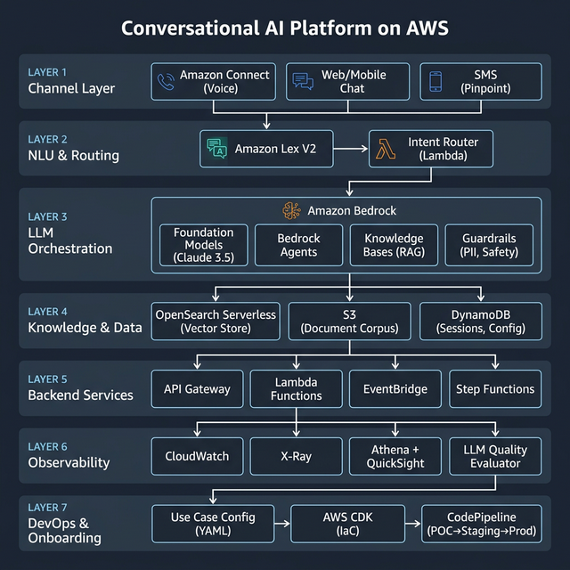
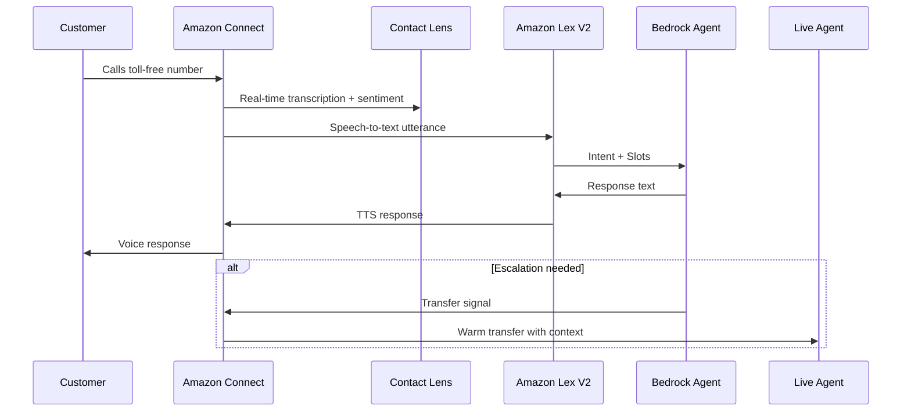
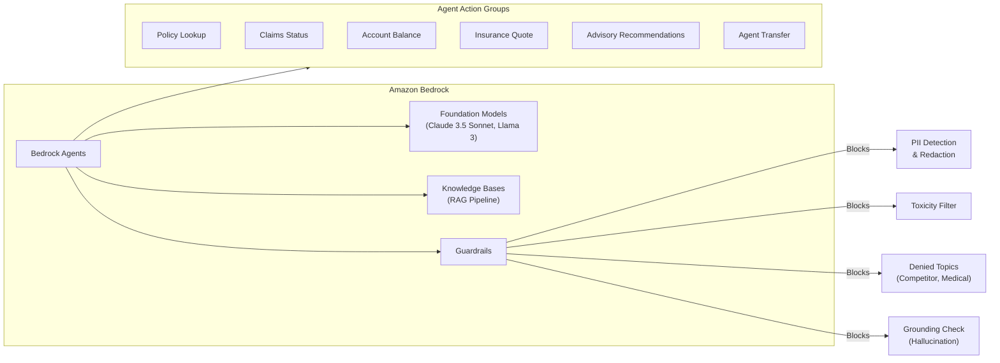
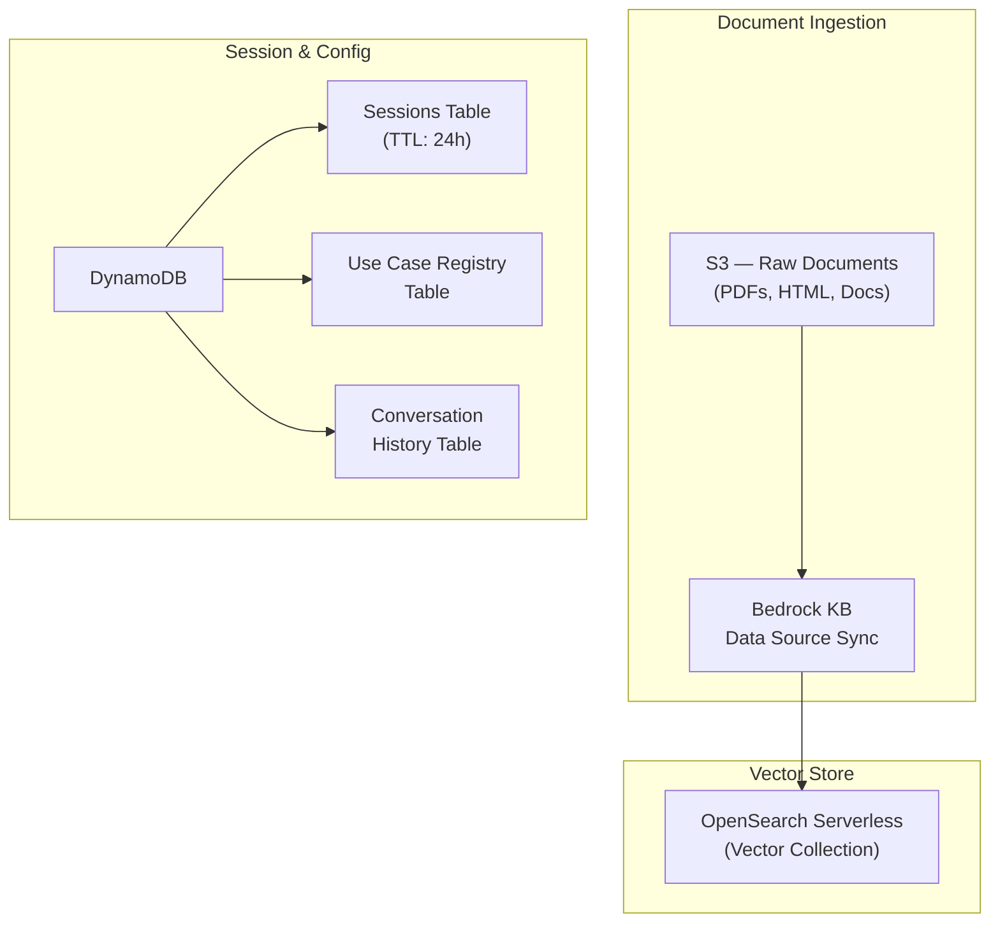
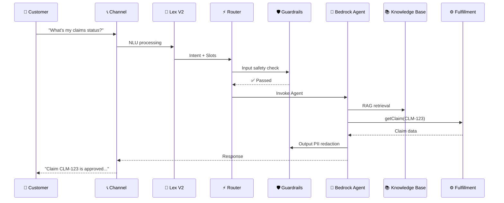

# Conversational AI Platform — System Architecture

A self-service, multi-channel Conversational AI platform for a financial services company (insurance, banking, advisory products), built entirely on AWS with **Amazon Bedrock** at its core. The platform enables any Line-of-Business (LOB) partner to onboard new use cases rapidly (POC in days, prod in weeks) with minimal code.

---

## Architecture Overview

---

## Layer Breakdown

### ① Channel Layer — Voice & Text

All customer interactions enter through unified channels and converge into **Amazon Lex V2** for consistent NLU processing.

| Channel | AWS Service | Details |
|---------|-------------|---------|
| **Voice** | **Amazon Connect** | IVR flows, real-time transcription via Contact Lens, warm transfer to live agents |
| **Web/Mobile Chat** | **Amazon Connect Chat** or custom via API Gateway WebSocket | Rich UI, file attachments, persistent sessions |
| **SMS** | **Amazon Pinpoint** | Two-way SMS for notifications, simple Q&A |

**Voice Flow:**

---

### ② NLU & Intent Routing

**Amazon Lex V2** handles:
- Multi-turn conversations with slot filling
- Per-LOB bot aliases (insurance bot, banking bot, advice bot)
- Locale/language support

**Intent Router Lambda:**
- Reads the **Use Case Registry** (DynamoDB) to determine which Bedrock Agent or fulfillment flow handles each intent
- Supports **config-driven routing** — new intents added via config, not code
- Attaches session context, customer tier, LOB identifier

---

### ③ LLM Orchestration — Amazon Bedrock

This is the **brain** of the platform. All LLM needs flow through Bedrock.

**Key Design Decisions:**

| Concern | Solution |
|---------|----------|
| **Model selection** | Claude 3.5 Sonnet (primary), Llama 3 (cost-sensitive fallback) — configurable per intent |
| **Safety** | Bedrock Guardrails: PII redaction, toxicity filtering, denied topic blocking, grounding checks |
| **Knowledge retrieval** | Bedrock Knowledge Bases with OpenSearch Serverless vector store |
| **Complex workflows** | Bedrock Agents with Action Groups calling backend Lambdas |
| **Multi-step flows** | AWS Step Functions for stateful processes (e.g., claims filing) |

> **⚠️ Financial Compliance:** All Bedrock model invocation logs MUST be enabled and stored in S3 with encryption. Guardrails must block financial advice that could constitute unauthorized advisory services.

---

### ④ Knowledge & Data Layer

| Store | Purpose | Key Details |
|-------|---------|-------------|
| **S3** | Document corpus | Product docs, policy PDFs, FAQs — per LOB prefix |
| **OpenSearch Serverless** | Vector embeddings | Bedrock Titan Embeddings V2; auto-scaled |
| **DynamoDB — Sessions** | Conversation state | Customer context, slot values, escalation history; TTL auto-cleanup |
| **DynamoDB — Use Case Registry** | Intent config | Maps intent → agent, model, guardrail profile, fulfillment Lambda |
| **DynamoDB — Conversation History** | Audit trail | Full conversation logs for compliance + analytics |

---

### ⑤ Backend Services

| Service | Role |
|---------|------|
| **API Gateway** | REST + WebSocket endpoints for chat clients |
| **AWS Lambda** | Fulfillment functions (claims, quotes, account ops) |
| **AWS Step Functions** | Multi-step workflow orchestration |
| **Amazon EventBridge** | Event bus for async processing and decoupling |
| **Amazon SQS** | Async task queues (document processing, notifications) |

---

### ⑥ Observability

See [03-observability.md](03-observability.md) for the full 3-tier observability strategy.

---

### ⑦ DevOps & Use Case Onboarding

See [02-onboarding-pipeline.md](02-onboarding-pipeline.md) for the onboarding and CI/CD pipeline.

---

## End-to-End Request Flow

---

## AWS Services Summary

| Category | Services |
|----------|----------|
| **Channels** | Amazon Connect, Connect Chat, Pinpoint |
| **NLU** | Amazon Lex V2 |
| **LLM/AI** | Amazon Bedrock (Models, Agents, Knowledge Bases, Guardrails) |
| **Compute** | AWS Lambda, Step Functions |
| **Data** | DynamoDB, S3, OpenSearch Serverless |
| **API** | API Gateway (REST + WebSocket) |
| **Events** | EventBridge, SQS, Kinesis Firehose |
| **Observability** | CloudWatch, X-Ray, Athena, QuickSight |
| **Security** | Cognito, WAF, KMS, CloudTrail, IAM, VPC |
| **IaC** | Terraform (infra), CDK (use case onboarding) |
| **CI/CD** | **GitLab CI/CD** |
| **Analytics** | AWS Glue, Athena, QuickSight |

---

## Use Case Examples by LOB

| LOB | Use Cases | Channel Priority |
|-----|-----------|------------------|
| **Insurance** | Get a quote, check claim status, file a claim, policy renewal, coverage Q&A | Voice + Chat |
| **Banking** | Account balance, transaction history, dispute a charge, card activation, loan status | Chat + Voice |
| **Advisory** | Schedule appointment, portfolio Q&A, market updates, retirement planning FAQ | Chat |
