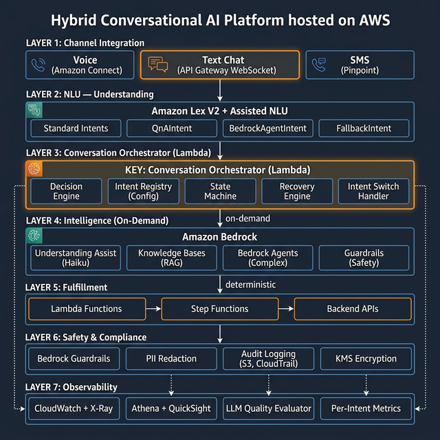
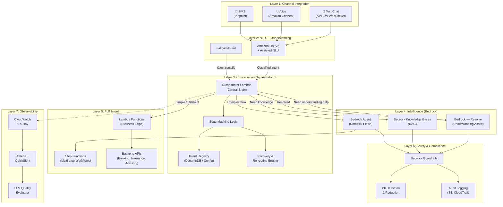
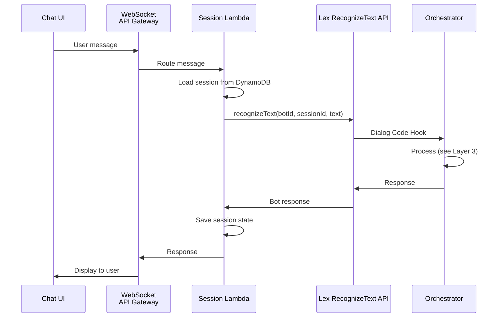
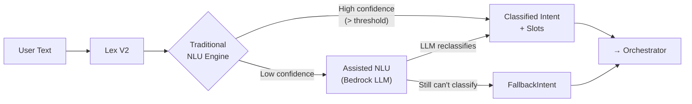
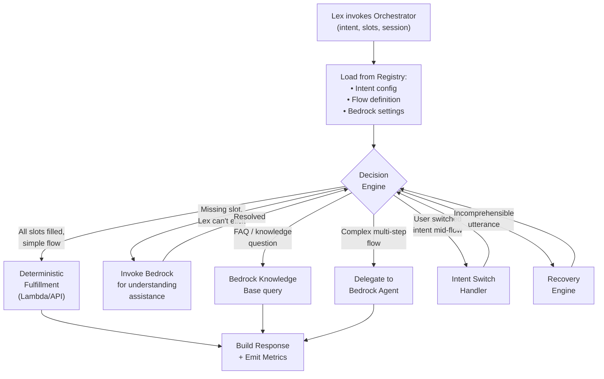
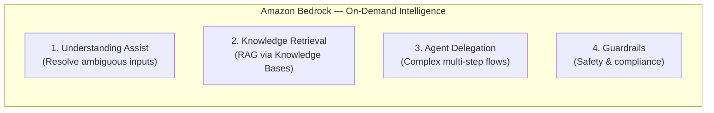

# Recommended Architecture — 7 Layers



## Why Hybrid Orchestrator?

Given our constraints — team Lex expertise, financial compliance requirements, text-first priority, and the need for rapid intent onboarding — the **Hybrid Orchestrator** architecture evolves the existing platform incrementally rather than replacing it.

**Core philosophy:** Deterministic by default, LLM-assisted when needed, LLM-delegated when required.

---

## Architecture Diagram



---

## Layer 1: Channel Integration

**Purpose:** Normalize all customer inputs into a consistent format before reaching the NLU layer.

| Channel | Service | How It Connects |
|---------|---------|----------------|
| **Text Chat** (Primary) | API Gateway (WebSocket) | Client sends text → WebSocket → Lambda → Lex runtime API |
| **Voice** | Amazon Connect | Call → Connect Contact Flow → Lex bot (ASR built-in) |
| **SMS** | Amazon Pinpoint | Two-way SMS → Lambda → Lex runtime API |

**Key design point for text-first:** Text goes through the Lex **Runtime API** (`RecognizeText`), not the full Lex bot flow. This means:
- The WebSocket Lambda has full control over the session
- It can intercept before or after Lex if needed
- The front-end chat UI gets rich responses (buttons, cards, carousels) that Lex alone can't provide



### Why Not Skip Lex for Text?

We considered this (Option C). The reasons to **keep Lex in the text path**:
1. **Team knows it** — retraining the team on pure Bedrock Agent development is a 3-6 month investment
2. **Deterministic flows are safer** — for compliance-critical intents, we want predictable behavior
3. **Lex Assisted NLU gives us LLM classification** — we get LLM-enhanced understanding without abandoning Lex
4. **Incremental path** — as team skills grow, we progressively move more intents to BedrockAgentIntent

---

## Layer 2: NLU — Natural Language Understanding

**Purpose:** Classify what the user wants and extract key information (slots/parameters).

### Lex V2 with Assisted NLU



**Assisted NLU modes:**

| Mode | Behavior | When to Use |
|------|----------|-------------|
| **Fallback** | LLM activates only when traditional NLU has low confidence | Default — cost-optimized, safer |
| **Primary** | LLM is the main classifier for every turn | For bots where traditional NLU struggles |

**Recommendation:** Start with **Fallback mode** — lets the team use familiar Lex training while getting LLM help only when Lex struggles. Switch specific bots to Primary mode once the team is comfortable.

### Intent Types Available in Lex V2

| Type | When to Use | Goes To |
|------|-------------|---------|
| **Standard Intent** | Predictable flows with known utterances and slots | Orchestrator → Deterministic fulfillment |
| **QnAIntent** | Customer questions answerable from documents | Bedrock KB (automatic, no Lambda needed) |
| **BedrockAgentIntent** | Complex, open-ended conversations | Bedrock Agent (full agent takeover) |
| **FallbackIntent** | Nothing matches | Orchestrator → Recovery engine |

---

## Layer 3: Conversation Orchestrator 🧠 (THE KEY LAYER)

**Purpose:** The central brain that controls every conversation. This is the existing "front Lambda" evolved into a smart, config-driven orchestrator.

### Why This Layer is Critical

The orchestrator is the **single point of control** for:
- Routing decisions (deterministic vs. Bedrock-assisted vs. Agent)
- Conversation state management
- Intent switching and recovery
- Compliance enforcement
- Metrics emission

### Orchestrator Architecture



### Intent Registry — Config-Driven Routing

Every intent has a config entry that tells the orchestrator **how to handle it**:

```yaml
# Intent Registry (stored in DynamoDB or S3 config)

intents:
  CheckBalance:
    type: deterministic
    fulfillment: banking/check_balance_handler
    slots_required: [accountType]
    slot_resolution:
      accountType:
        bedrock_assist: true    # ask Bedrock if user is ambiguous
        valid_values: [checking, savings, investment, credit_card]
    max_recovery_attempts: 2
    escalate_to: live_agent

  ClaimStatus:
    type: deterministic
    fulfillment: insurance/claim_status_handler
    slots_required: [claimId]
    slot_resolution:
      claimId:
        bedrock_assist: false   # strict — must provide claim ID
    max_recovery_attempts: 2

  FileNewClaim:
    type: bedrock_agent         # complex — delegate to agent
    agent_id: insurance-claims-agent
    guardrails: financial_strict
    escalate_to: claims_specialist

  ProductQuestion:
    type: knowledge             # FAQ — use Knowledge Base
    knowledge_base_id: product-kb
    guardrails: financial_standard

  General:                      # Catch-all for FallbackIntent
    type: bedrock_resolve       # ask Bedrock to classify
    fallback_message: "I'm not sure I understood. Could you rephrase that?"
    max_attempts: 2
    escalate_to: live_agent
```

### Adding a New Intent (The Onboarding Story)

**Step 1:** Add the Lex intent (utterances + slots) — or configure as BedrockAgentIntent

**Step 2:** Add the intent config to the registry:
```yaml
  ActivateCard:
    type: deterministic
    fulfillment: banking/activate_card_handler
    slots_required: [cardLast4, dateOfBirth]
```

**Step 3:** Write the Lambda handler (or reuse a template):
```python
def handler(event, context):
    card = event['slots']['cardLast4']
    dob = event['slots']['dateOfBirth']
    result = banking_api.activate_card(card, dob)
    return {"message": f"Card ending in {card} has been activated."}
```

**Step 4:** Deploy via GitLab pipeline.

**Total effort: 1-2 days.** The orchestrator picks up the new intent automatically from the registry.

---

## Layer 4: Intelligence — Amazon Bedrock

**Purpose:** Provide LLM capabilities on-demand. Bedrock is **never the default path** — the orchestrator decides when to invoke it.

### Four Bedrock Capabilities



| Capability | Invoked When | Model | Cost |
|-----------|-------------|-------|------|
| **Understanding Assist** | Orchestrator can't resolve a slot or user response is ambiguous | Claude 3.5 Haiku (fast, cheap) | ~$0.0001/call |
| **Knowledge Retrieval** | User asks a question best answered from documents | Titan Embeddings + Claude | ~$0.001/query |
| **Agent Delegation** | Flow requires multi-step reasoning, tool calling, dynamic decisions | Claude 3.5 Sonnet | ~$0.005/conversation |
| **Guardrails** | Every Bedrock invocation (automatic) | N/A (policy-based) | Included |

### Understanding Assist — How It Works

When the orchestrator has a slot it can't resolve:

```python
# In the Orchestrator Lambda
def resolve_slot_with_bedrock(slot_name, user_text, context):
    """Ask Bedrock to help understand what the user meant."""
    
    prompt = f"""You are assisting a banking chatbot.
The user was asked: "{context['slot_prompt']}"
The user responded: "{user_text}"
Valid values for {slot_name}: {context['valid_values']}

What is the most likely intended value? 
Reply with ONLY the value, or "UNCLEAR" if you cannot determine it.
Provide a brief reasoning."""

    response = bedrock.invoke_model(
        modelId="anthropic.claude-3-5-haiku",
        body=json.dumps({"prompt": prompt, "max_tokens": 50})
    )
    return response  # e.g., {"value": "checking", "reasoning": "bills are paid from checking"}
```

### Knowledge Bases (RAG)

For `QnAIntent` or when the orchestrator routes a knowledge question:

```
User: "What's the deductible on my homeowner's policy?"
  → Orchestrator identifies this as type: knowledge
  → Queries Bedrock KB with user's question
  → KB searches OpenSearch vector store against policy documents
  → Bedrock generates grounded answer with citations
  → Orchestrator returns response through Lex
```

### Bedrock Agent — When the Orchestrator Delegates

Some conversations are too complex for slot-based flows. The orchestrator recognizes this and **delegates the full conversation to a Bedrock Agent:**

- Filing a claim (multi-step: collect info → check coverage → submit → schedule adjuster)
- Disputing a charge (investigate → collect evidence → submit dispute → track)
- Advisory conversations (open-ended financial planning Q&A)

The Agent has its own tools (Action Groups) and manages its own conversation until resolution, then returns control to the orchestrator.

---

## Layer 5: Fulfillment — Business Logic

**Purpose:** Execute the actual business operations behind each intent.

| Component | Use Case |
|-----------|----------|
| **Lambda Functions** | Single-step operations: check balance, activate card, get quote |
| **Step Functions** | Multi-step workflows: file claim, open account, process dispute |
| **Backend APIs** | Existing banking/insurance/advisory APIs the Lambdas call |
| **EventBridge** | Async events: send confirmation email, trigger downstream processing |

### Lambda Organization

```
lambdas/
├── shared/
│   ├── bedrock_client.py        # Shared Bedrock invocation wrapper
│   ├── guardrails.py            # Pre/post guardrail checks
│   ├── response_builder.py      # Standardized response formatting
│   └── session_manager.py       # DynamoDB session read/write
├── banking/
│   ├── check_balance.py
│   ├── activate_card.py
│   ├── dispute_charge.py
│   └── transaction_history.py
├── insurance/
│   ├── get_quote.py
│   ├── claim_status.py
│   ├── file_claim.py
│   └── policy_renewal.py
└── advisory/
    ├── schedule_appointment.py
    └── portfolio_faq.py
```

---

## Layer 6: Safety & Compliance

**Purpose:** Ensure every interaction is safe, compliant, and auditable.

### Guardrails Configuration

```yaml
guardrail_profiles:

  financial_strict:          # For advisory, investment-related
    pii_redaction:
      enabled: true
      types: [SSN, CREDIT_CARD, ACCOUNT_NUMBER, DOB]
    denied_topics:
      - "specific investment recommendations"
      - "guaranteed returns"
      - "competitor comparisons"
    grounding:
      enabled: true
      threshold: 0.7        # block response if < 70% grounded in KB
    toxicity:
      enabled: true
      threshold: LOW

  financial_standard:        # For general banking/insurance
    pii_redaction:
      enabled: true
      types: [SSN, CREDIT_CARD]
    denied_topics:
      - "unauthorized financial advice"
    grounding:
      enabled: true
      threshold: 0.5
    toxicity:
      enabled: true
```

### Audit Trail

| What | Where | Retention |
|------|-------|-----------|
| All API calls | CloudTrail | 1 year |
| Bedrock model invocations (input + output) | S3 (encrypted, KMS) | 3 years |
| Conversation transcripts | DynamoDB → S3 archive | 7 years |
| PII redaction events | CloudWatch Logs | 1 year |

---

## Layer 7: Observability & Continuous Improvement

**Purpose:** Know how every intent performs and continuously improve.

### Three Tiers of Observability

| Tier | What | Tools | Frequency |
|------|------|-------|-----------|
| **Infrastructure** | Lambda errors, Lex confidence, Bedrock latency | CloudWatch, X-Ray | Real-time |
| **Conversation Analytics** | Per-intent containment, fallback rate, Bedrock assist rate | Athena, QuickSight | Near real-time |
| **Quality Evaluation** | Accuracy, helpfulness, compliance of responses | Bedrock LLM evaluator | Daily batch |

### Key Metrics Per Intent

| Metric | What It Tells Us |
|--------|-----------------|
| **Containment rate** | % resolved without human escalation |
| **Bedrock assist rate** | How often the orchestrator needed Bedrock to understand the user |
| **Slot resolution success rate** | How often Bedrock successfully resolved ambiguous slots |
| **Intent switch rate** | How often users change intent mid-flow |
| **Recovery success rate** | How often the recovery engine saved a failing conversation |
| **Avg turns to resolution** | Conversation length (fewer = better) |
| **Cost per conversation** | Bedrock token usage + Lambda invocations |

### Improvement Feedback Loop

```
Observe (metrics) → Analyze (LLM evaluator) → Suggest (improvements) → Implement (config change) → Observe
```

- LLM evaluator scores conversations daily
- Identifies intents with declining quality
- Suggests: "Add these utterances to Lex training," "Update this KB article," "Adjust this guardrail"
- Team reviews and applies changes — config-driven, not code changes

---

## Layer Summary Table

| Layer | Purpose | Key AWS Services | Team Skill Required |
|-------|---------|-----------------|-------------------|
| **1. Channel** | Connect users | API Gateway, Connect, Pinpoint | Existing |
| **2. NLU** | Understand user text | Lex V2 + Assisted NLU | **Existing (Lex)** |
| **3. Orchestrator** | Central brain — route, recover, manage state | Lambda, DynamoDB | **Core development** |
| **4. Intelligence** | LLM on-demand | Bedrock (Models, KB, Agents, Guardrails) | **Incremental learning** |
| **5. Fulfillment** | Execute business logic | Lambda, Step Functions, APIs | Existing |
| **6. Safety** | Compliance, PII, audit | Bedrock Guardrails, KMS, CloudTrail | **Incremental learning** |
| **7. Observability** | Monitor, improve | CloudWatch, Athena, QuickSight | Existing |
