# Conversation Flow Handling — Intent Switching, Recovery & Orchestrator Patterns

How the platform handles real-world conversation challenges: mid-flow intent switching, incomprehensible utterances, slot resolution failures, multi-intent requests, and graceful recovery. All examples use the Hybrid Orchestrator (Option B).

---

## The Orchestrator's Decision Loop

Every conversational turn flows through this loop:

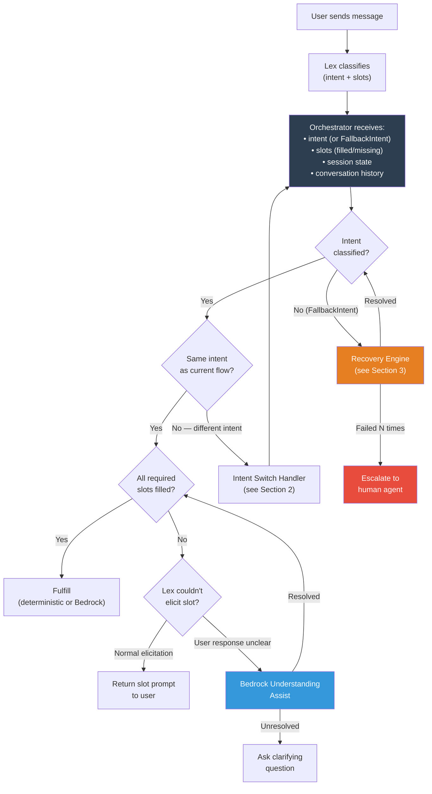

---

## 1. Happy Path — Single Intent, Resolved Successfully

The simplest case. Lex classifies correctly, slots fill normally, fulfillment succeeds.

### Example: Check Account Balance

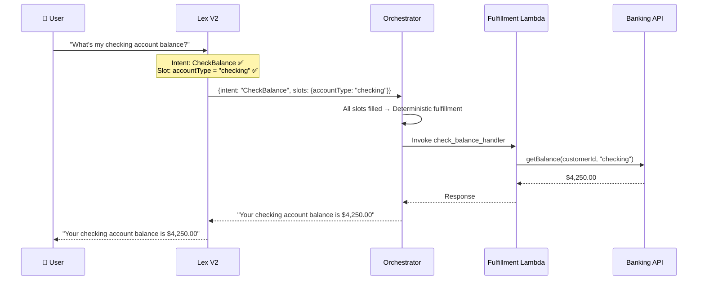

**Cost:** $0 Bedrock usage. Pure Lex + Lambda. ~200ms latency.

---

## 2. Intent Switching Mid-Flow

**The challenge:** User starts one flow, then changes their mind or asks about something else mid-conversation.

### Example 2a: Clean Intent Switch

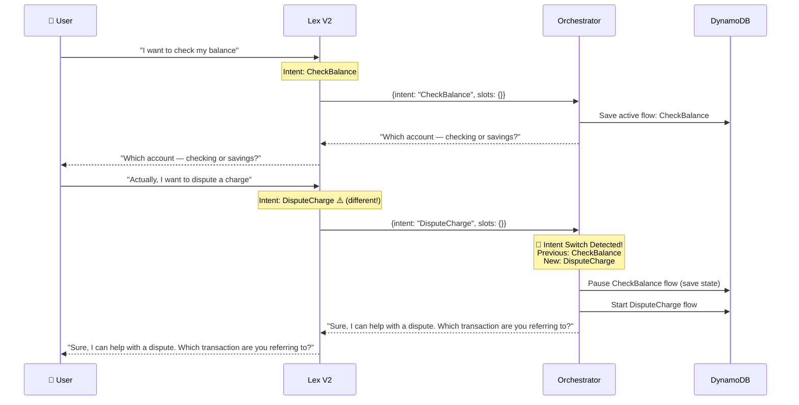

**What the Orchestrator does:**
1. Detects the intent change (current session was `CheckBalance`, new request is `DisputeCharge`)
2. Saves the paused flow state in DynamoDB (in case user wants to return)
3. Starts the new flow
4. Optionally: after the new flow completes, asks "Would you still like to check your balance?"

### Example 2b: Ambiguous Intent Switch (Lex Reclassifies vs. Slot Response)

This is the tricky case — the user says something during slot elicitation that *looks* like a new intent:

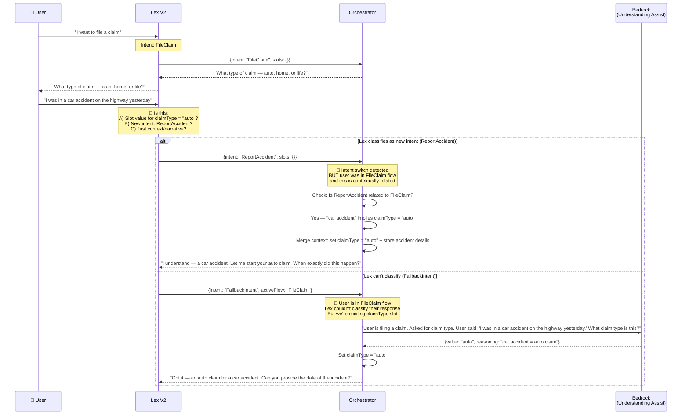

**The orchestrator's logic:**
```python
def handle_turn(event, session):
    new_intent = event['intent']
    active_flow = session.get('active_flow')
    
    # Case 1: No active flow — just route normally
    if not active_flow:
        return route_intent(new_intent, event['slots'])
    
    # Case 2: Same intent — continue flow
    if new_intent == active_flow['intent']:
        return continue_flow(active_flow, event['slots'])
    
    # Case 3: FallbackIntent during active flow — user is probably
    # responding to our question, Lex just didn't understand
    if new_intent == 'FallbackIntent':
        return attempt_resolution(active_flow, event['user_text'])
    
    # Case 4: Different intent — is it related to active flow?
    if is_related_intent(new_intent, active_flow['intent']):
        return merge_into_flow(active_flow, new_intent, event)
    
    # Case 5: Completely different intent — clean switch
    return switch_intent(active_flow, new_intent, event)
```

---

## 3. Incomprehensible Utterances — Recovery Engine

**The challenge:** User says something Lex cannot classify at all.

### Recovery Strategy Ladder

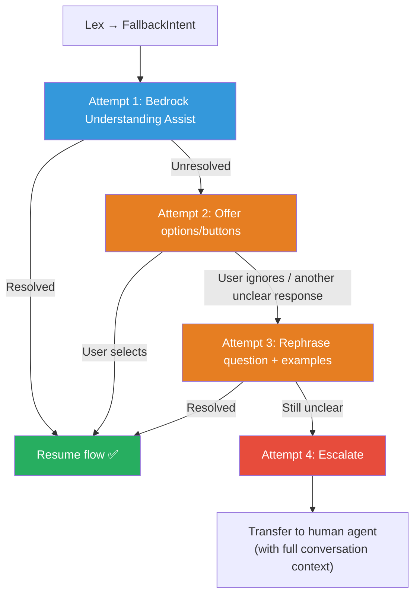

### Example 3a: Nonsensical Input

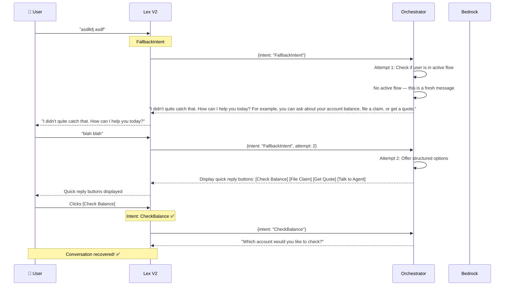

### Example 3b: Unclear Slot Response With Bedrock Assist

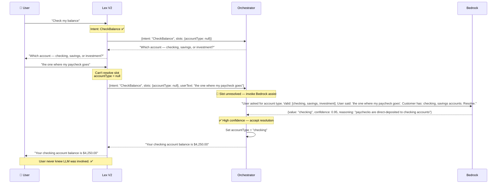

### Example 3c: Low Confidence — Ask for Clarification

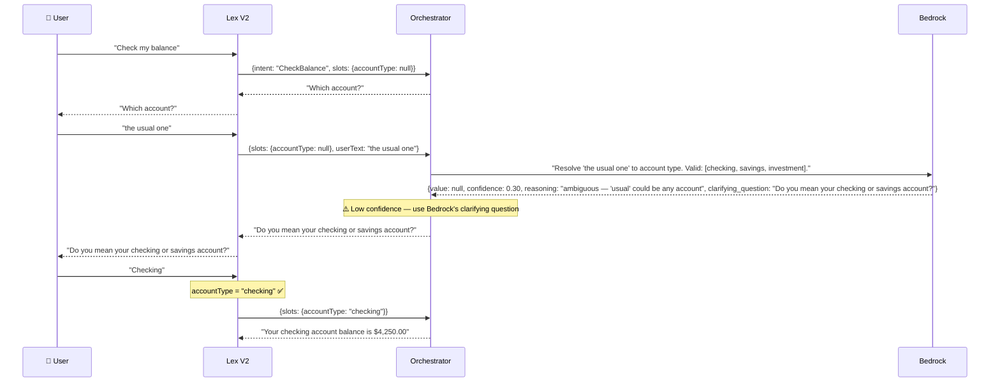

---

## 4. Mid-Flow Topic Detour (Side Question)

**The challenge:** User asks a related but off-topic question in the middle of a flow, then wants to resume.

### Example: Side Question During Claim Filing

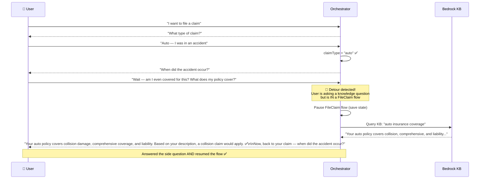

**Orchestrator logic:**
```python
def handle_detour(active_flow, new_intent, user_text):
    """Handle a side question during an active flow."""
    
    # Check if it's a knowledge question
    if new_intent == 'QnAIntent' or is_knowledge_question(user_text):
        # Answer the question
        answer = query_knowledge_base(user_text)
        
        # Resume the active flow
        next_prompt = get_next_slot_prompt(active_flow)
        
        return f"{answer}\n\nNow, back to your {active_flow['intent']} — {next_prompt}"
    
    # If it's a completely different intent, do a clean switch
    return switch_intent(active_flow, new_intent)
```

---

## 5. Multi-Intent Request (User Asks Two Things at Once)

### Example: "Check my balance and also dispute a charge"

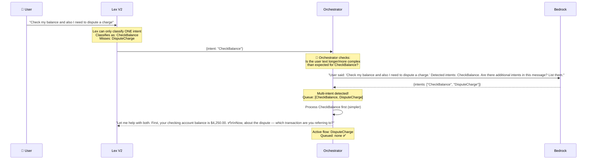

---

## 6. Bedrock Agent Takeover and Handback

When the orchestrator delegates to a Bedrock Agent for complex flows, the Agent manages the conversation independently until resolution, then returns control.

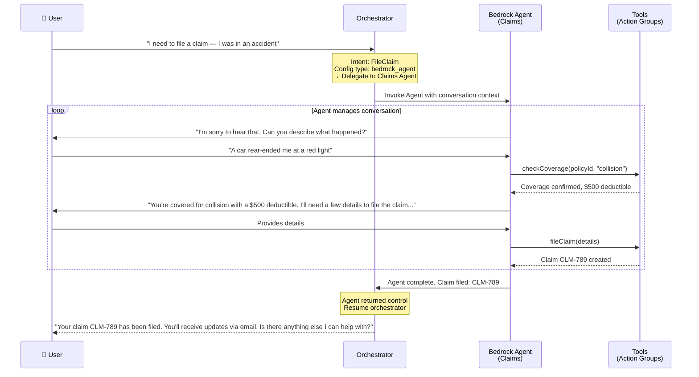

---

## 7. Orchestrator State Machine — Complete View

The orchestrator tracks conversation state for each session:

```json
{
  "sessionId": "sess-12345",
  "customerId": "cust-67890",
  "active_flow": {
    "intent": "CheckBalance",
    "state": "eliciting_slot",
    "current_slot": "accountType",
    "slots_filled": {},
    "attempt_count": 1,
    "bedrock_assist_count": 0
  },
  "paused_flows": [],
  "queued_intents": [],
  "conversation_history": [
    {"role": "user", "text": "Check my balance", "timestamp": "..."},
    {"role": "bot", "text": "Which account?", "timestamp": "..."}
  ],
  "metrics": {
    "total_turns": 2,
    "bedrock_invocations": 0,
    "intent_switches": 0,
    "recovery_attempts": 0
  }
}
```

---

## 8. Recovery Configuration Per Intent

Each intent in the registry can define its own recovery behavior:

```yaml
intents:
  CheckBalance:
    recovery:
      slot_resolution:
        accountType:
          bedrock_assist: true
          fallback_options: ["checking", "savings", "investment"]  # show buttons
          max_bedrock_attempts: 2
      on_fallback_intent:
        strategy: bedrock_resolve    # ask Bedrock to understand
        max_attempts: 2
        then: offer_buttons          # if Bedrock can't resolve, show options
      on_repeated_failure:
        action: escalate
        message: "Let me connect you with a team member who can help."

  DisputeCharge:
    recovery:
      on_fallback_intent:
        strategy: bedrock_agent      # this is complex — hand to agent immediately
      on_repeated_failure:
        action: escalate
        priority: high               # disputes get priority escalation
```

---

## Summary: How the Orchestrator Handles Every Scenario

| Scenario | Orchestrator Action |
|----------|-------------------|
| **Happy path** | Lex classifies → Orchestrator fulfills deterministically |
| **Lex classifies with low confidence** | Assisted NLU (L1) kicks in automatically |
| **Slot can't be resolved** | Orchestrator invokes Bedrock to understand → resolved or clarifying question |
| **FallbackIntent (no active flow)** | Retry with Bedrock understanding → offer buttons → escalate |
| **FallbackIntent (during active flow)** | Assume user is responding to current prompt → Bedrock resolves in context |
| **Intent switch (clean)** | Pause current flow → start new flow → optionally return |
| **Intent switch (related)** | Merge into current flow (e.g., accident context into claim) |
| **Side question / detour** | Answer from KB → resume active flow |
| **Multi-intent** | Bedrock extracts all intents → queue and process sequentially |
| **Complex flow** | Delegate to Bedrock Agent → Agent returns control when done |
| **Repeated failures** | Escalate to human agent with full conversation context |
