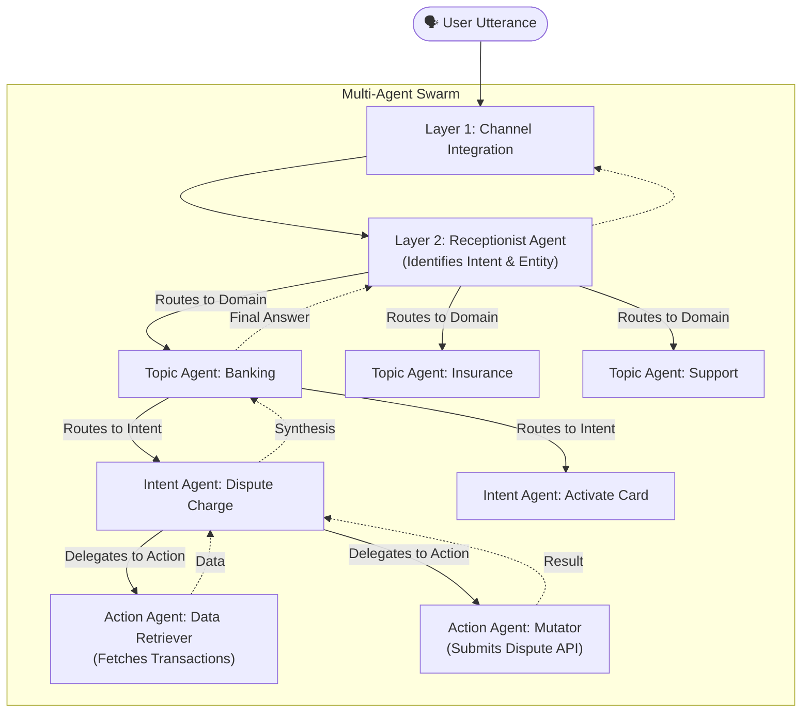
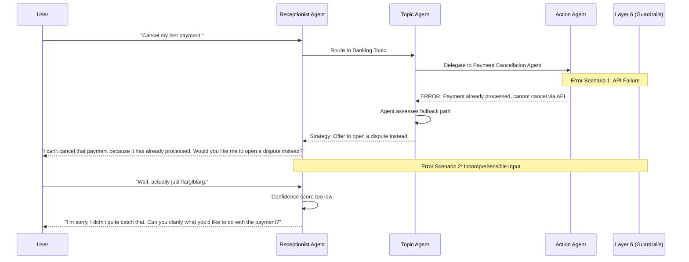

# Hierarchical Multi-Agent Architecture

Building on the 7-layer foundation, this architecture explores a fully multi-agentic, hierarchical flow as the future state of the conversational platform. Instead of a single centralized orchestrator lambda, control is distributed across specialized, purpose-built AI agents.

## Core Concept: Specialization

As the platform scales, a single orchestrator becomes too complex. The solution is creating a **hierarchical flow** where each sub-agent is specialized for specific topics, intents, and actions. 

1. **Receptionist Agent:** The first point of contact. Understands the exact intent and routes it appropriately.
2. **Topic Agents (High-Level):** Specialized in a broad domain (e.g., Banking, Insurance, Tech Support).
3. **Intent Agents (Middle-Level):** Specialized in managing a specific conversational goal (e.g., Claim Status, Fraud Alert).
4. **Action Agents (Deep-Level):** Highly specialized agents for executing concrete tasks safely and accurately (e.g., Database Querier, API Invoker, File Summarizer).

---

## 7 Lays Mapping: The Multi-Agent Evolution

This architecture still fits perfectly within our 7-layer framework. We simply evolve Layers 2 through 5 from deterministic lambdas to an orchestrated swarm of Bedrock Agents.

| Layer | Component in Multi-Agent Architecture |
|-------|---------------------------------------|
| **1. Channel Integration** | Unchanged (Text, Voice, SMS via API Gateway/Connect) |
| **2. NLU (Understanding)** | **Receptionist Agent** (Replacing Lex. Acts as the primary router and intent classifier) |
| **3. Orchestrator** | **Supervisor / Topic Agents** (Replaces the central lambda. Routes to the correct domain) |
| **4. Intelligence** | **Intent Agents & Action Agents** (Specialized Bedrock Agents handling complex reasoning) |
| **5. Fulfillment** | **Agentic Tools** (Lambdas exposed as Action Group tools to the deep agents) |
| **6. Safety & Compliance** | Unchanged (Bedrock Guardrails applied to all agent outputs) |
| **7. Observability** | Enhanced **Agentic Feedback Loop** (Tracking agent-to-agent handoffs) |

---

## The Hierarchical Agent Flow Diagram

This diagram shows how the boxes talk to each other, moving from high-level understanding down to specialized actions.



### How they talk to each other:
- **Hand-offs:** Agents communicate via strictly defined JSON payloads. The Receptionist extracts context (like `accountId`) and passes it downstream.
- **Synthesis:** Deep action agents return raw deterministic data (e.g., a JSON dispute confirmation). The Intent or Topic Agent synthesizes that raw data back into natural language.

---

## Error Handling Scenarios

In a multi-agent system, error handling (Layer 3 & 4) is managed through **delegation fallback**.



**Key Error Strategies:**
1. **Tool Execution Failures:** The Action Agent receives the error from the API/Lambda. Instead of crashing, it reasons over the error and passes the failure reason back to the Intent Agent, which decides the next conversational pivot.
2. **Handoff Failures:** If the Receptionist isn't sure which Topic Agent to invoke, it triggers a **Clarification Loop** directly with the user before routing.
3. **Guardrail Interventions:** If at any point an agent drafts a non-compliant response, Layer 6 steps in, overriding the response with a standard safe message.

---

## The Agentic Feedback Loop (Layer 7)

A crucial part of multi-agent architecture is the feedback loop for continuous improvement. Since many agents are acting dynamically, we need strict observability over their interactions.

```mermaid
graph LR
    subgraph Operations
        Rec[Receptionist] --> Top[Topic] --> Int[Intent] --> Act[Action]
    end
    
    subgraph Observability (Layer 7)
        Logs["Agent CloudWatch Logs\n(Traces routing paths)"]
        Eval["LLM Quality Evaluator\n(Daily Batch Job)"]
        Dash["Performance Dashboard\n(Athena + QuickSight)"]
    end
    
    subgraph Feedback Loop
        Human["Prompt Engineers &\nSubject Matter Experts"]
        Update["Update Agent\nInstructions & Tools"]
    end
    
    Operations -.->|Handoff Traces & Latency| Logs
    Logs --> Eval
    Eval -->|Identifies Routing Errors| Dash
    Dash --> Human
    Human --> Update
    Update --> Operations
```

**How the loop works:**
1. **Trace Capture:** Every conversation emits traces of *which* agents were invoked and the exact JSON context passed between them.
2. **Quality Evaluation:** An offline evaluator (another automated Bedrock process) reviews the transcripts looking for:
   - Misroutings (e.g., Receptionist sent banking query to Insurance Topic Agent).
   - Hallucinations at the synthesis stage.
   - Excessive agent-to-agent hop latency.
3. **Human Polish:** When analytics flag that the "Insurance Topic Agent" is struggling to route a specific query, engineers tweak the system prompt for that specific agent, rather than modifying the entire monolithic bot.
