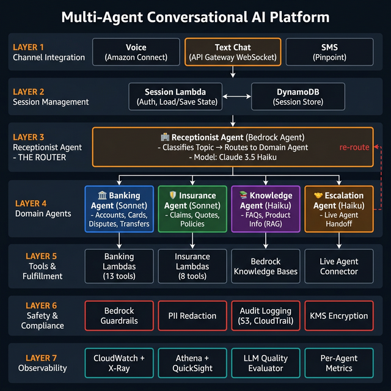
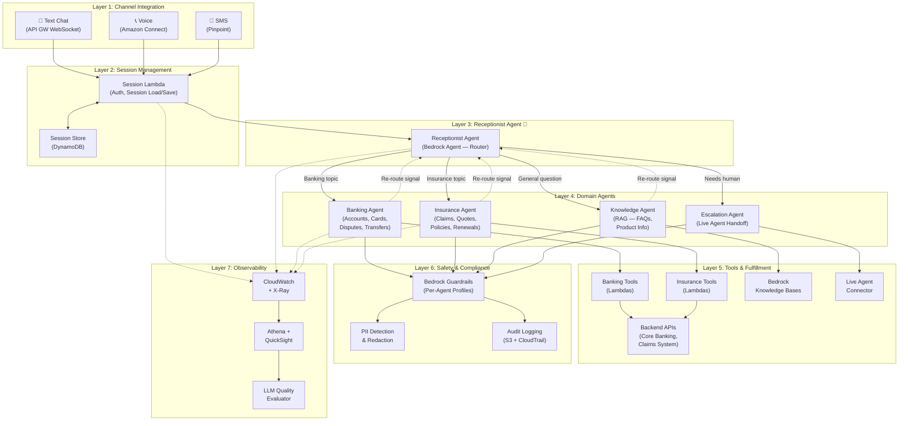
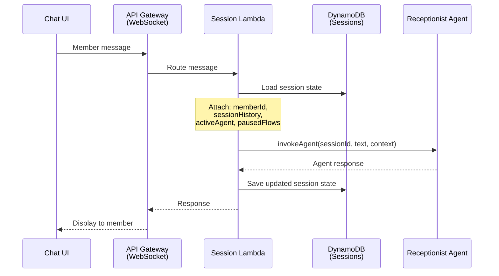
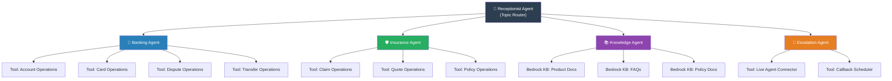
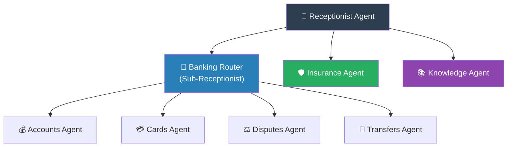

# Architecture Overview



## High-Level Architecture

The platform is a hierarchy of Amazon Bedrock Agents, each specialized for a level of the conversation:



---

## Layer-by-Layer Breakdown

### Layer 1: Channel Integration

Same as ver4 — normalize all member inputs into text before reaching the agent layer.

| Channel | Service | Connection |
|---------|---------|-----------|
| **Text Chat** (Primary) | API Gateway WebSocket | Client → WebSocket → Session Lambda |
| **Voice** | Amazon Connect | Call → Connect → Lex (ASR only) → Session Lambda |
| **SMS** | Amazon Pinpoint | SMS → Lambda → Session Lambda |

**Voice note:** For voice, we still use Lex **purely for ASR** (speech-to-text). Once transcribed, the text follows the same path as chat. Lex is not doing NLU, intent classification, or slot elicitation — just converting audio to text.

### Layer 2: Session Management

A lightweight **Session Lambda** handles authentication, session load/save, and message routing:



**Session state** (stored in DynamoDB):

```json
{
  "sessionId": "sess-abc123",
  "memberId": "mbr-67890",
  "activeAgent": "banking",
  "activeFlow": {
    "topic": "dispute_charge",
    "collectedInfo": { "transactionId": "txn-555" },
    "pendingQuestion": "What is the reason for your dispute?"
  },
  "pausedFlows": [],
  "conversationHistory": [
    { "role": "member", "text": "I need to dispute a charge", "agent": "receptionist" },
    { "role": "agent", "text": "I'll connect you with our banking team.", "agent": "receptionist" },
    { "role": "agent", "text": "Which transaction?", "agent": "banking" }
  ],
  "metrics": {
    "totalTurns": 3,
    "agentHandoffs": 1,
    "toolInvocations": 0
  }
}
```

### Layer 3: Receptionist Agent (The Router)

The **first and only agent the member interacts with initially**. It understands *why* the member is reaching out and routes to the right domain agent.

- **Does:** Classify topic, greet the member, route to domain agent
- **Doesn't:** Answer detailed questions, invoke business tools, collect information for actions
- **Key behavior:** Fast classification, minimal turns, handoff with context

### Layer 4: Domain Agents

Specialized agents that handle all intents within their domain. Each has:
- Focused **system instructions** (how to behave, what to know)
- **Tool definitions** (Action Groups — the Lambdas it can call)
- **Guardrail profile** (safety rules specific to its domain)

See [03-agent-definitions.md](03-agent-definitions.md) for detailed specifications of each agent.

### Layer 5: Tools & Fulfillment

Each domain agent has access to tools via Bedrock Agent **Action Groups**. Tools are Lambda functions that call backend APIs.

```
Banking Agent Action Groups:
  ├── AccountTools: getBalance, getTransactions, getStatements
  ├── CardTools: activateCard, blockCard, replaceCard, setLimit
  ├── DisputeTools: fileDispute, getDisputeStatus, uploadEvidence
  └── TransferTools: internalTransfer, externalTransfer, getTransferStatus

Insurance Agent Action Groups:
  ├── ClaimTools: fileClaim, getClaimStatus, uploadDocument
  ├── QuoteTools: getQuote, compareQuotes
  └── PolicyTools: getPolicyDetails, renewPolicy, updateBeneficiary

Knowledge Agent:
  └── Bedrock Knowledge Base (RAG over product docs, FAQs, policy documents)
```

### Layer 6: Safety & Compliance

**Every agent has a Guardrails profile** attached. Guardrails are applied automatically by Bedrock on every model invocation.

| Profile | Applied To | Rules |
|---------|-----------|-------|
| `financial_strict` | Banking Agent, Insurance Agent | PII redaction (SSN, account numbers), deny investment advice, grounding check |
| `financial_standard` | Knowledge Agent | PII redaction, deny unauthorized advice, grounding check (lower threshold) |
| `minimal` | Receptionist, Escalation Agent | PII redaction only (these agents don't generate substantive advice) |

### Layer 7: Observability

Enhanced for multi-agent architecture — tracking agent-to-agent handoffs, per-agent performance, and routing accuracy.

| What to Track | How |
|--------------|-----|
| Agent routing accuracy | Was the Receptionist's routing correct? (Evaluated by offline LLM evaluator) |
| Per-agent containment rate | Did the domain agent resolve the issue without escalation? |
| Handoff latency | Time between agents during a transition |
| Tool success rate | Did the Lambda tool return a valid result? |
| Conversation length | Total turns to resolution |
| Cost per conversation | Bedrock token usage across all agents involved |

---

## Agent Hierarchy — For the Financial Institution



### Future Splitting (When Agents Grow)

When the Banking Agent accumulates 15+ tools and its instructions become too long for reliable model behavior, split it:



The Banking Agent becomes a **Banking Router** — a sub-receptionist that routes within the banking domain. The pattern is recursive: any agent that gets too large becomes a router for its sub-agents.

---

## Technology Stack

| Component | AWS Service | Purpose |
|-----------|-----------|---------|
| Agents | Amazon Bedrock Agents | Conversation management, reasoning, tool calling |
| Models | Claude 3.5 Sonnet / Haiku | LLM powering each agent |
| Knowledge Bases | Bedrock Knowledge Bases | RAG for FAQs and product documents |
| Guardrails | Bedrock Guardrails | PII, denied topics, grounding, toxicity |
| Tools | AWS Lambda | Business logic behind each agent tool |
| Workflows | AWS Step Functions | Multi-step backend workflows |
| Session Store | Amazon DynamoDB | Conversation state and session management |
| Channel — Text | API Gateway (WebSocket) | Real-time text chat |
| Channel — Voice | Amazon Connect + Lex (ASR only) | Voice transcription only |
| Channel — SMS | Amazon Pinpoint | Two-way SMS |
| Observability | CloudWatch, X-Ray, Athena, QuickSight | Monitoring and analytics |
| Document Storage | Amazon S3 | KB source documents, audit logs, transcripts |
| Encryption | AWS KMS | Encryption at rest for all sensitive data |
