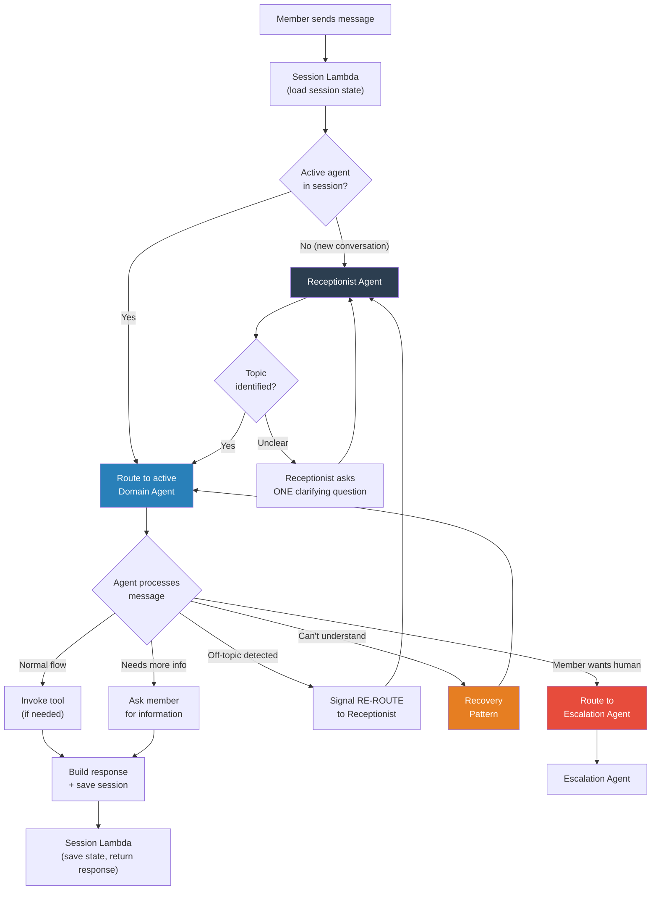
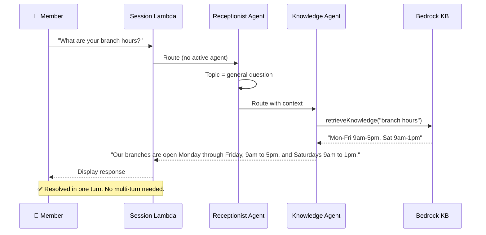
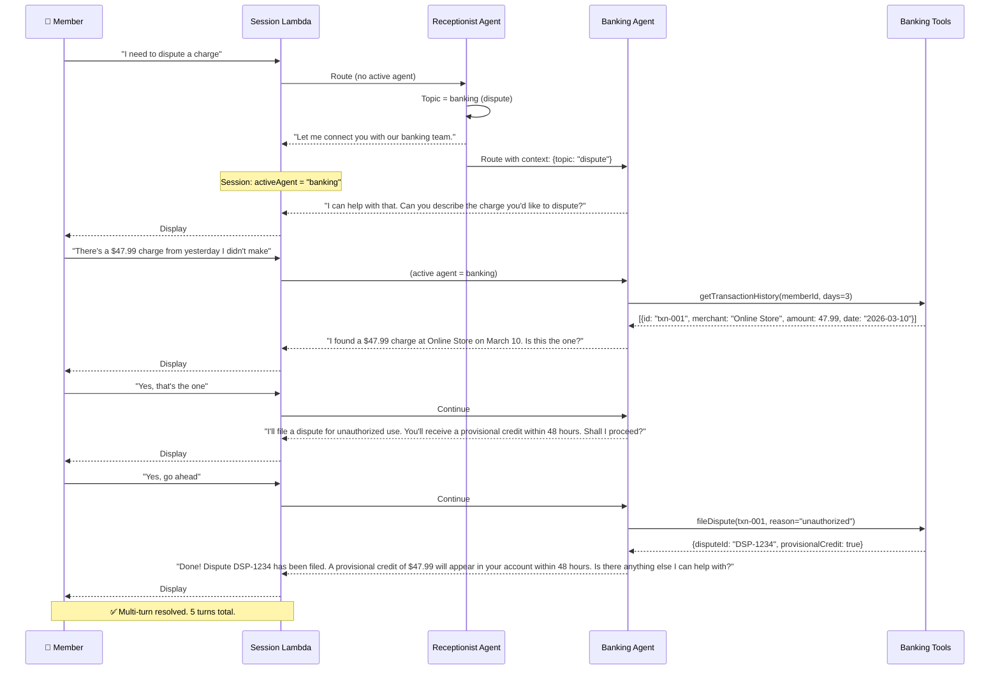
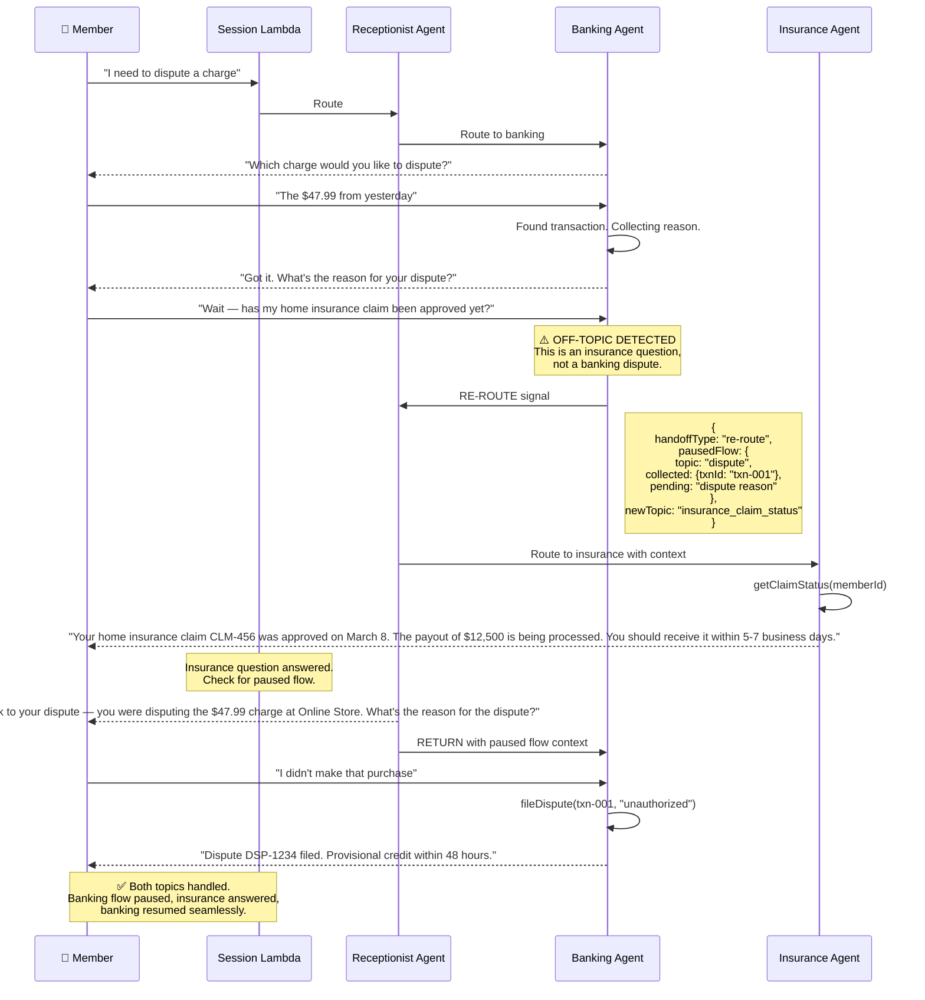
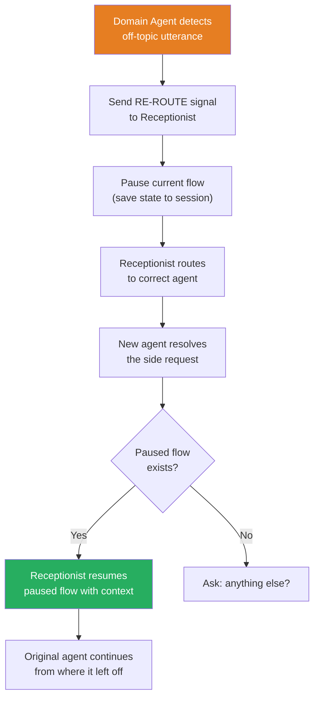
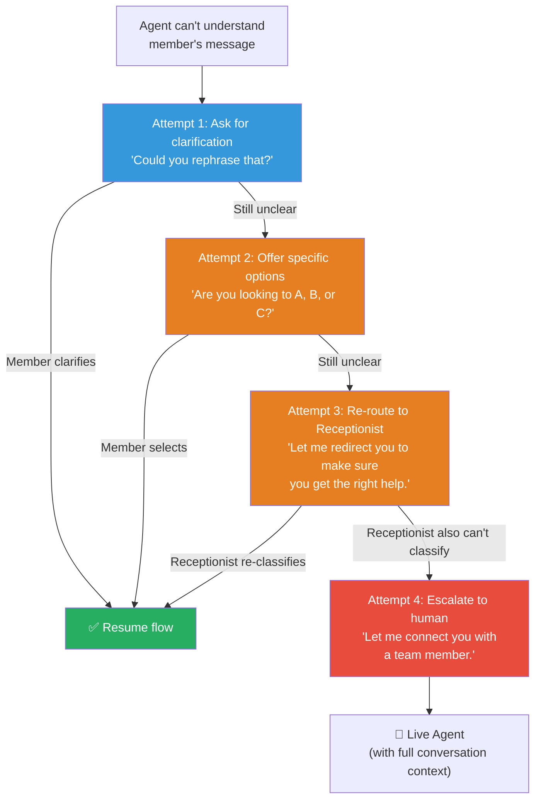
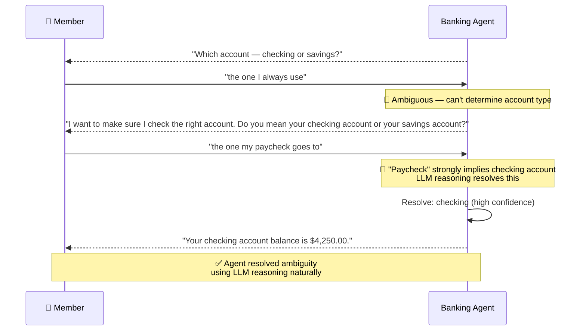
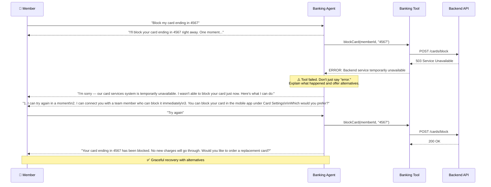
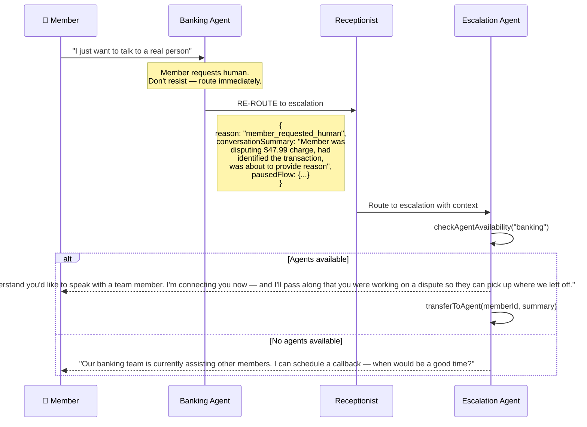
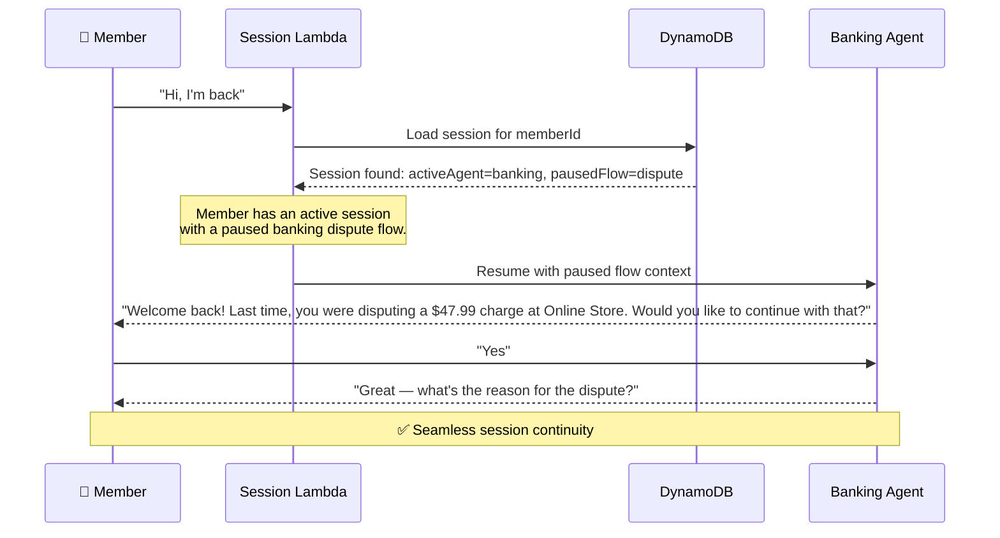

# Orchestration & Recovery Patterns

How agents hand off conversations, handle unexpected member inputs, recover from errors, and manage mid-flow topic switches. This document covers both the **happy path** and every recovery scenario.

---

## The Orchestration Loop

Every member message flows through this loop:

---

## 1. Happy Path — Zero-Shot (FAQ)

The simplest case. Member asks a question, Knowledge Agent answers in one turn.

**Cost:** 2 agent invocations (Receptionist Haiku + Knowledge Haiku + KB query). ~$0.001.

---

## 2. Happy Path — Multi-Turn (Action)

Member wants to take an action that requires information collection.

---

## 3. Mid-Flow Topic Switch

The member changes topics during a conversation. This is the most important recovery pattern — it must feel seamless.

### Scenario: Banking → Insurance → Resume Banking

### How It Works — The Re-Route Protocol

---

## 4. Incomprehensible or Ambiguous Input

When the agent can't understand what the member is saying.

### Recovery Ladder

### Example: Ambiguous Input During Information Collection

---

## 5. Tool Execution Failure

When a backend API or Lambda fails.

---

## 6. Member Explicitly Requests a Human

At any point, if the member asks for a human, the current agent immediately defers to the Escalation Agent.

---

## 7. Returning Member (Session Continuity)

If a member returns within the session window, the system picks up the conversation.

---

## Orchestration State Machine — Complete View

Summary of all scenarios and how the system handles them:

| # | Scenario | What Happens | Who Handles It |
|---|----------|-------------|----------------|
| 1 | **FAQ (zero-shot)** | Receptionist → Knowledge Agent → Answer | Knowledge Agent |
| 2 | **Multi-turn action** | Receptionist → Domain Agent → Collect info → Tool → Response | Domain Agent |
| 3 | **Topic switch mid-flow** | Domain Agent detects off-topic → RE-ROUTE → Resolve → Resume | Receptionist (coordinator) |
| 4 | **Ambiguous input** | Agent uses LLM reasoning to resolve, or asks for clarification | Current Domain Agent |
| 5 | **Incomprehensible input** | Clarify → Options → Re-route → Escalate (ladder) | Current Agent → Receptionist → Escalation |
| 6 | **Tool failure** | Agent explains the issue, offers alternatives (retry, human, self-service) | Current Domain Agent |
| 7 | **Member requests human** | Immediate route to Escalation Agent with full context | Escalation Agent |
| 8 | **Returning member** | Session loaded from DynamoDB, resume paused flow | Session Lambda → Domain Agent |
| 9 | **Multi-topic request** | Receptionist identifies primary topic, handles first, then asks about second | Receptionist (sequencing) |
