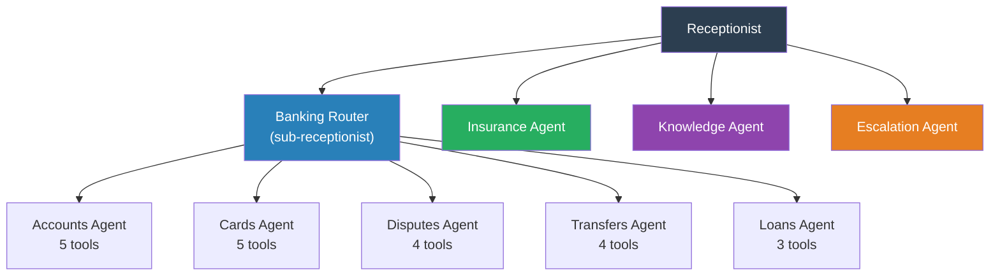

# Onboarding & Scaling Guide

How to add new intents, add new agents, right-size agent boundaries, and plan for future growth.

---

## Adding a New Intent (to an Existing Agent)

Adding a new capability to an existing agent takes **1-2 days**. No Lex training, no utterance management, no bot rebuilding.

### Step-by-Step

**Example: Add "Set Up Direct Deposit" to the Banking Agent**

#### Step 1: Define the Tool (5 min)

Add the tool definition to the Banking Agent's Action Group:

```json
{
  "name": "setupDirectDeposit",
  "description": "Set up or update direct deposit information for a member's account. Requires the member's employer name, routing number, and account type.",
  "parameters": {
    "memberId": { "type": "string", "required": true, "description": "The member's ID" },
    "accountType": { "type": "string", "required": true, "enum": ["checking", "savings"] },
    "routingNumber": { "type": "string", "required": true, "description": "Employer's bank routing number" },
    "employerName": { "type": "string", "required": true, "description": "The employer's name" }
  },
  "returns": {
    "success": "boolean",
    "directDepositForm": "string (URL to pre-filled form)",
    "confirmationNumber": "string"
  }
}
```

#### Step 2: Write the Lambda Handler (2-4 hours)

```python
def handler(event, context):
    member_id = event['parameters']['memberId']
    account_type = event['parameters']['accountType']
    routing_number = event['parameters']['routingNumber']
    employer_name = event['parameters']['employerName']

    result = banking_api.setup_direct_deposit(
        member_id=member_id,
        account_type=account_type,
        routing_number=routing_number,
        employer_name=employer_name
    )

    return {
        "success": True,
        "directDepositForm": result['formUrl'],
        "confirmationNumber": result['confirmationNumber']
    }
```

#### Step 3: Update Agent Instructions (Optional, 15 min)

If the new tool needs special handling, add guidance to the Banking Agent's instructions:

```
DIRECT DEPOSIT:
- When setting up direct deposit, confirm the employer name and routing number
  before submitting
- If the member doesn't have their routing number, suggest they check with their
  employer's HR or payroll department
```

#### Step 4: Update Receptionist (If Needed, 5 min)

Usually the Receptionist already routes banking topics to the Banking Agent, so no change needed. If the new capability introduces a new *topic* (not just a new intent within banking), update the Receptionist's routing rules.

#### Step 5: Deploy via Pipeline

```
git add tools/banking/setup_direct_deposit.py
git add config/banking-agent-tools.json
git commit -m "feat: add direct deposit setup to banking agent"
git push
# → GitLab pipeline deploys Lambda + updates Agent Action Group
```

**Total effort: ~1 day** (mostly writing and testing the Lambda handler).

---

## Adding a New Agent

When a new product line or domain is introduced, add a new domain agent.

### When to Add a New Agent vs. Extending an Existing One

| Signal | Action |
|--------|--------|
| New topic is **within an existing domain** (e.g., new card feature) | Add a tool to the existing agent |
| New topic is a **new product line** (e.g., Investment Advisory) | Create a new agent |
| Existing agent has **>15 tools** and instructions are getting complex | Split into sub-agents |
| New topic needs **different conversational style** (e.g., advisory is open-ended vs. banking is transactional) | Create a new agent |

### Step-by-Step: Adding an Investment Agent

#### Step 1: Define the Agent

| Field | Value |
|-------|-------|
| Name | Investment Agent |
| Model | Claude 3.5 Sonnet |
| Guardrail | `financial_strict` (investment advice is highest-risk) |
| Tools | `getPortfolio`, `getMarketData`, `scheduleAdvisorMeeting`, `getInvestmentOptions` |

#### Step 2: Write System Instructions

```
You are the Investment Specialist for [Company Name]...
(similar structure to Banking Agent instructions, tailored for investments)
```

#### Step 3: Define Tools and Lambdas

Same pattern as Banking Agent — JSON tool definitions + Lambda handlers.

#### Step 4: Update the Receptionist's Routing Rules

Add to the Receptionist's instructions:

```
- Investment topics (portfolio, stocks, bonds, retirement, 401k, IRA,
  mutual funds, market) → route to "investment"
```

#### Step 5: Deploy

```
git add agents/investment/
git add config/receptionist-instructions.txt  # updated routing
git commit -m "feat: add investment agent with portfolio tools"
git push
```

**Total effort: ~3-5 days** (most time is writing and testing the Lambdas).

---

## Right-Sizing Agents

### The "Right Size" Guidelines

```
┌─────────────────────────────────────────────────────┐
│                  AGENT SIZE SPECTRUM                │
│                                                     │
│  TOO NARROW          JUST RIGHT         TOO BROAD   │
│  (1-3 tools)         (5-15 tools)       (20+ tools) │
│                                                     │
│  ❌ Too many         ✅ Focused but     ❌ Confused  │
│     agents,             capable            model,   │
│     overhead                               degraded │
│     per handoff                             quality │
└─────────────────────────────────────────────────────┘
```

### Sizing Heuristics

| Rule | Explanation |
|------|-------------|
| **5-15 tools per agent** | Below 5, the agent is too narrow and creates unnecessary handoffs. Above 15, the instruction set gets too complex and model performance degrades. |
| **Coherent domain** | All tools in an agent should be thematically related. "Activate card" and "check balance" belong together (both banking). "Activate card" and "file claim" don't. |
| **Single conversational style** | If one set of tools needs cautious, confirming language (disputes) and another needs fast, transactional language (balance checks), they can coexist — but start watching for splitting signals. |
| **Instructions fit in ~500 words** | If the agent's instructions exceed ~500 words, the model starts losing focus on edge cases. Time to split. |

### Today's Agent Sizes

| Agent | Tool Count | Status |
|-------|-----------|--------|
| Receptionist | 1 | ✅ Intentionally minimal |
| Banking | 13 | ⚠️ Approaching limit — monitor |
| Insurance | 8 | ✅ Comfortable |
| Knowledge | 1 | ✅ By design |
| Escalation | 3 | ✅ Stable |

---

## Future Splitting Strategy

When an agent grows too large, it becomes a **Router Agent** with specialized sub-agents beneath it. The pattern is identical to the Receptionist → Domain hierarchy.

### Example: Splitting the Banking Agent

**Before (today):**
```
Receptionist → Banking Agent (13 tools: accounts + cards + disputes + transfers)
```

**After (when banking grows to 20+ tools):**
```
Receptionist → Banking Router → Accounts Agent (5 tools)
                               → Cards Agent (5 tools)
                               → Disputes Agent (4 tools)
                               → Transfers Agent (4 tools)
                               → Loans Agent (new, 3 tools)
```

### The Banking Router's Instructions

```
You are the Banking Router for [Company Name]. A member has been directed to you
for a banking inquiry. Determine which banking specialty they need:

- Account inquiries (balances, statements, account opening/closing) → "accounts"
- Card issues (activation, blocking, limits, replacement) → "cards"
- Disputes (transaction disputes, fraud claims) → "disputes"
- Transfers (moving money between accounts, external transfers) → "transfers"
- Loans and credit (loan applications, payments, rates) → "loans"

Ask ONE clarifying question if needed, then route.
```



### Splitting Checklist

When deciding to split an agent, follow this checklist:

- [ ] Agent has **>15 tools** — model quality is degrading
- [ ] Instructions exceed **~500 words** — hard to maintain focus
- [ ] **Different conversational styles** are conflicting within the agent
- [ ] Agent handles **distinct sub-domains** with little overlap
- [ ] Team needs to **iterate on one sub-domain** without affecting others

### How to Split (Migration Path)

1. **Create the Router Agent** with routing instructions (same pattern as Receptionist)
2. **Create sub-agents** by extracting tool groups from the original agent
3. **Move tools** from the original agent to the sub-agents
4. **Update session management** to handle the additional hierarchy level
5. **Update the Receptionist** to route to the Router instead of the monolithic agent
6. **Deploy incrementally** — start with one sub-agent, validate, then migrate the rest

---

## Config-Driven Agent Management

To make onboarding and scaling as frictionless as possible, consider an **Agent Registry** — a config file or DynamoDB table that the Session Lambda reads to know which agents exist and how to access them.

### Agent Registry (YAML)

```yaml
agents:
  receptionist:
    agentId: "arn:aws:bedrock:us-east-1:123456789:agent/receptionist"
    model: "claude-3.5-haiku"
    guardrailId: "minimal-guardrail"
    type: "router"
    routes:
      - topic: "banking"
        targetAgent: "banking"
      - topic: "insurance"
        targetAgent: "insurance"
      - topic: "general"
        targetAgent: "knowledge"
      - topic: "escalation"
        targetAgent: "escalation"

  banking:
    agentId: "arn:aws:bedrock:us-east-1:123456789:agent/banking"
    model: "claude-3.5-sonnet"
    guardrailId: "financial-strict-guardrail"
    type: "domain"
    actionGroups:
      - "account-tools"
      - "card-tools"
      - "dispute-tools"
      - "transfer-tools"

  insurance:
    agentId: "arn:aws:bedrock:us-east-1:123456789:agent/insurance"
    model: "claude-3.5-sonnet"
    guardrailId: "financial-strict-guardrail"
    type: "domain"
    actionGroups:
      - "claim-tools"
      - "quote-tools"
      - "policy-tools"

  knowledge:
    agentId: "arn:aws:bedrock:us-east-1:123456789:agent/knowledge"
    model: "claude-3.5-haiku"
    guardrailId: "financial-standard-guardrail"
    type: "knowledge"
    knowledgeBases:
      - "product-docs-kb"
      - "faq-kb"
      - "policy-docs-kb"

  escalation:
    agentId: "arn:aws:bedrock:us-east-1:123456789:agent/escalation"
    model: "claude-3.5-haiku"
    guardrailId: "minimal-guardrail"
    type: "escalation"
    actionGroups:
      - "live-agent-tools"
```

### Benefits of the Registry

| Benefit | How |
|---------|-----|
| **Add a new agent** | Add an entry to the registry + deploy the Bedrock Agent |
| **Update routing** | Change the Receptionist's `routes` config |
| **Swap models** | Change the `model` field (e.g., Haiku → Sonnet for Knowledge Agent) |
| **Feature flags** | Add `enabled: true/false` to enable/disable agents without redeploying |
| **A/B testing** | Add `weight` to routes to split traffic between agent versions |

---

## Deployment Pipeline

```mermaid
flowchart LR
    Dev["Developer\npushes code"] --> MR["Merge Request\n(GitLab)"]
    MR --> Review["Code Review\n+ Approval"]
    Review --> Build["Build Pipeline"]

    Build --> Unit["Unit Tests\n(Lambda handlers)"]
    Unit --> Int["Integration Tests\n(Agent + Tools)"]
    Int --> Deploy["Deploy to\nStaging"]
    Deploy --> Smoke["Smoke Tests\n(automated conversations)"]
    Smoke --> Prod["Deploy to\nProduction"]

    style Build fill:#3498db,color:#fff
    style Prod fill:#27ae60,color:#fff
```



### What Gets Deployed

| Change | Deployment Step |
|--------|----------------|
| New Lambda (tool) | Deploy Lambda + update Agent Action Group |
| New Agent | Deploy Bedrock Agent + Lambda tools + update registry |
| Instruction update | Update Agent prompt (no code deploy needed) |
| Routing change | Update Receptionist instructions or registry config |
| Knowledge Base update | Upload new docs to S3 → KB auto-syncs |

---

## Environment Promotion

```
DEV → STAGING → PRODUCTION
```

| Environment | Purpose | Agent Config |
|------------|---------|-------------|
| **DEV** | Development and testing | Separate agent instances, test data |
| **STAGING** | Pre-prod validation, smoke tests | Mirrors prod agents, staging APIs |
| **PRODUCTION** | Live member traffic | Production agents, production APIs |

Each environment has its own:
- Bedrock Agent instances (separate ARNs)
- Lambda aliases (dev/staging/prod)
- DynamoDB tables (per-env)
- Agent Registry config (per-env)
